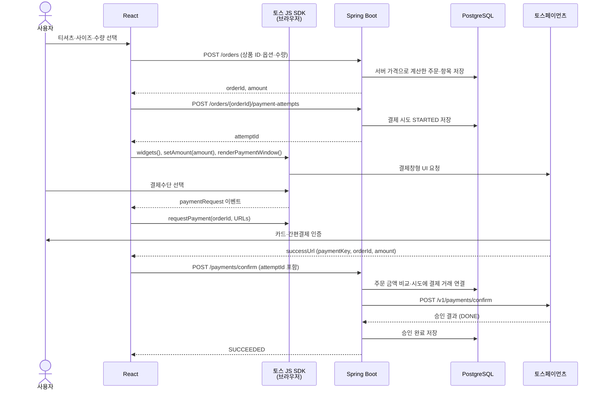

# Payment Service

토스페이먼츠의 결제 흐름을 배우는 Spring Boot + React MVP입니다. 캐릭터 아바타에 티셔츠를 입혀보고, **상품 10종 선택 → 장바구니 → 주문 → 결제수단 인증 → 서버 승인 → 결과가 불확실하면 즉시 재조회·조건부 취소 → 주문 내역 조회**를 다룹니다.

먼저 [상품·주문·결제 도메인](docs/shop-domain.md)과 [기본 결제 흐름](docs/payment-domain.md)을 읽고, [코드 읽는 순서](docs/code-reading-guide.md)대로 따라가세요.

## 어떤 토스 연동인가요?

토스가 신규 연동에 권장하는 **결제창형 결제(기존 결제위젯)**와 SDK v2를 사용합니다. 결제 버튼을 누르면 `widgets()` → `setAmount()` → `renderPaymentWindow()`로 결제창을 열고, 구매자가 수단을 선택한 `paymentRequest` 이벤트에서 `widgets.requestPayment()`를 호출합니다.

브라우저 SDK와 서버 API의 버전은 별개입니다. 서버 승인·조회·취소는 `/v1/payments/confirm`, `/v1/payments/{paymentKey}`, `/v1/payments/{paymentKey}/cancel`을 사용합니다. 현재 의존성인 `@tosspayments/tosspayments-sdk` 2.8.1은 결제창형 메서드를 지원합니다. [결제창형 연동 가이드](https://docs.tosspayments.com/guides/v2/payment-widget/integration-window), [SDK 명세](https://docs.tosspayments.com/sdk/v2/js/payment-window)

## 기본 결제 흐름



승인 결과가 불확실하면 같은 `POST /payments/confirm` 처리 중 토스 GET으로 재조회합니다. 같은 주문·결제키의 승인 금액·통화가 다르면 `CANCEL_PENDING`과 취소 멱등키를 DB에 저장한 뒤 즉시 취소 API를 호출하고 결과를 저장합니다. 주문번호나 결제키가 다른 거래는 자동 취소하지 않습니다.

토스 JS SDK는 별도로 배포하는 서버가 아니라 React와 같은 브라우저에서 실행되는 라이브러리입니다. React가 전달한 결제 정보를 토스 형식으로 요청하고 결제창을 여는 역할이 분명하므로 흐름에서는 별도 참여자로 표시했습니다.

사용자가 인증을 마치면 토스는 브라우저를 `successUrl` 또는 `failUrl`로 이동시킵니다. `successUrl`에는 최종 승인에 필요한 `paymentKey`, `orderId`, `amount`가 포함됩니다.

**successUrl에 도착한 것은 결제수단 인증 성공이지 결제 완료가 아닙니다.** 서버가 승인 API의 결과를 확인하고 저장해야 결제 완료입니다. 인증에 실패하면 `failUrl`로 이동해 오류를 표시하며 승인 API를 호출하지 않습니다.

서버는 브라우저의 금액을 DB의 주문 금액과 비교하고, 토스에는 DB의 금액으로 승인을 요청합니다. 클라이언트 키는 브라우저에서 사용하고 시크릿 키는 서버에만 둡니다.

## 실행하기

프런트엔드 화면을 수정하거나 새 화면을 만들 때는 루트의 [디자인 가이드](DESIGN.md)를 참고하세요. [PC·모바일 아바타 시안](docs/design/avatar/README.md)도 볼 수 있습니다.

준비: Java 21, Node.js 22.18 이상, npm, 실행 중인 Docker Desktop.

### 1. PostgreSQL과 pgAdmin

```powershell
docker compose up -d
```

### 2. 토스 키 설정 후 백엔드 실행

토스 개발자센터에서 **주문서형·결제창형 연동 테스트 키 한 쌍**을 가져옵니다. 본인 상점의 키는 전자결제 신청 후 확인할 수 있으며, 신청 전에는 [공식 연동 문서의 테스트 키](https://docs.tosspayments.com/guides/v2/payment-widget/integration)를 사용할 수 있습니다. 키를 설정한 터미널에서 서버를 실행하세요.

```powershell
$env:TOSS_CLIENT_KEY = 'test_gck_로 시작하는 클라이언트 키'
$env:TOSS_SECRET_KEY = 'test_gsk_로 시작하는 시크릿 키'
.\gradlew.bat bootRun
```

macOS/Linux에서는 `export TOSS_CLIENT_KEY='...'`, `export TOSS_SECRET_KEY='...'`를 설정하고 `./gradlew bootRun`을 실행합니다.

키가 둘 다 없으면 주문 생성·조회만 가능합니다. `live_` 키, API 개별 연동 키(`test_ck_`, `test_sk_`), 한쪽만 설정한 키는 시작 시 검증에 실패합니다. 접두사만으로 실제 키의 짝을 확인할 수 없으므로 반드시 함께 발급된 키를 사용하세요. 시크릿 키를 프런트엔드나 Git에 넣지 마세요.

상점의 결제 어드민에서는 **카드·국내 간편결제만** 표시하도록 UI를 설정하세요. 별도 UI를 사용한다면 `TOSS_PAYMENT_METHOD_VARIANT_KEY`와 `TOSS_AGREEMENT_VARIANT_KEY`에 각각 결제수단·약관 UI의 `variantKey`를 설정합니다. 미설정 시 SDK 기본 UI를 사용합니다. 기본 UI에 계좌이체·가상계좌·브랜드페이 등 미지원 수단이 보이더라도 이 MVP는 인증 요청 전에 안내하고 중단합니다.

기존 버전에서 전환했다면 두 키를 함께 교체하고 서버와 프론트를 다시 실행하세요. DB 변경은 없습니다. 이전 개별 연동 키로 만든 결제는 새 키로 조회할 수 없으므로, 미확정 테스트 결제는 기존 설정에서 먼저 확인하고 새 제품은 새 주문으로 테스트하세요. [키 종류와 API 버전](https://docs.tosspayments.com/reference/using-api/api-keys)

### 3. 다른 터미널에서 프런트엔드 실행

```powershell
cd frontend
npm ci
npm run dev
```

| 화면 | 주소 |
| --- | --- |
| 테스트 스토어 | [127.0.0.1:5173](http://127.0.0.1:5173) |
| Swagger UI | [127.0.0.1:8080/swagger-ui.html](http://127.0.0.1:8080/swagger-ui.html) |
| pgAdmin | [127.0.0.1:5050](http://127.0.0.1:5050) |

pgAdmin 로컬 계정은 `admin@payment-service.com` / `payment_admin_local`입니다. Vite가 API 요청을 Spring Boot의 8080 포트로 전달합니다.

스토어에서 티셔츠를 고르면 별도 상품 상세 페이지에서 아바타 착용 모습과 사이즈를 확인할 수 있습니다. `장바구니 담기`를 누르면 장바구니 페이지로 이동합니다. 장바구니의 `결제하기`는 서버 주문과 결제 시도를 생성하고 서버 확정 금액으로 토스 테스트 결제창을 엽니다. 결제창 닫기·인증 실패는 시도에 기록하며, 명확한 승인 실패 뒤에는 같은 주문에서 새 시도를 만들 수 있습니다. 인증 후 서버 승인 결과 페이지에서 완료 여부를 확인하고 `결제 확인하기`로 주문 상세를 조회합니다. 개인 테스트 상점 키라면 개발자센터 결제내역도 함께 확인할 수 있습니다. 테스트 키로 진행한 결제는 실제 청구되지 않습니다.

| 프런트엔드 경로 | 화면 |
| --- | --- |
| `/` | 랜딩·상품 목록 |
| `/products/:productId` | 아바타 착용·사이즈 선택 |
| `/cart` | 장바구니·결제 시작 |
| `/payment/result` | 인증 복귀·서버 승인 결과 |
| `/orders`, `/orders/:orderId` | 주문번호 조회·주문 상세 |

## API와 상태

| Method | Endpoint | 역할 |
| --- | --- | --- |
| GET | `/products` | 판매 중인 티셔츠와 현재 가격 조회 (초기 10종) |
| GET | `/products/{id}` | 상품 상세 조회 |
| POST | `/orders` | 장바구니의 상품 ID·사이즈·수량으로 서버가 금액을 계산해 주문 생성 |
| GET | `/orders/{orderId}` | DB에 저장된 주문·결제 조회 |
| POST | `/orders/{orderId}/payment-attempts` | 결제창을 열기 전 시도 생성 |
| POST | `/payment-attempts/{attemptId}/authentication-result` | 결제창 닫기·인증 실패 기록 |
| GET | `/payment-config` | 공개 클라이언트 키와 결제 가능 여부 |
| POST | `/payments/confirm` | 인증 성공 후 받은 값을 검증하고 토스에 최종 승인 요청 |

주문 생성 요청에는 가격을 보내지 않습니다. 서버가 `products` 테이블의 `Product` 엔티티에서 현재 가격을 읽어 합계를 계산하고, 주문 당시 상품명·단가를 주문 항목에 복사해 저장합니다. 초기 티셔츠 10종은 Flyway V6가 한 번만 넣습니다. 상품 등록·수정·재고 관리 API는 아직 제공하지 않습니다.

```json
{
  "items": [
    { "productId": "tee-01", "size": "M", "quantity": 2 },
    { "productId": "tee-04", "size": "L", "quantity": 1 }
  ]
}
```

승인 요청은 다음 값을 받습니다. `paymentKey`는 인증 성공 후 `successUrl`로 받은 값을 사용합니다. `attemptId`는 결제창을 열기 직전에 서버가 만든 시도 ID입니다. 이전 클라이언트와의 호환을 위해 생략할 수 있지만, 새 화면은 항상 전달합니다.

```json
{
  "orderId": "서버가 생성한 주문번호",
  "paymentKey": "successUrl로 받은 토스 결제 키",
  "amount": 65000,
  "attemptId": "결제 시도 UUID"
}
```

아래는 **우리 서비스의 상태**입니다. 토스 원본 상태는 응답의 `pgStatus`에 따로 담습니다.

| 상태 | 의미 |
| --- | --- |
| READY | 아직 승인 거래가 없음. 결제창 취소·인증 실패는 `latestAttempt`에서 구분 |
| PROCESSING | 승인 요청 정보를 저장했고 처리 중 |
| SUCCEEDED | 주문·키·금액·통화와 토스 DONE 결과를 확인하고 저장 |
| FAILED | 명시적인 카드 거절 또는 토스 ABORTED·EXPIRED 확인 |
| UNKNOWN | 승인 결과가 불확실해 같은 요청 안에서 재조회할 때 저장하는 상태 |
| CANCEL_PENDING | 취소 의도와 멱등키를 저장했고 취소 결과를 기다리는 상태 |
| CANCELED | 토스 전액 취소 완료 확인 |
| REVIEW_REQUIRED | 서버에서 결과를 확정하지 못해 운영자 확인 필요 |

승인 API는 완료·취소 완료 시 200, 처리 중·운영 확인 필요 시 202, 확정 실패 시 422와 주문 본문을 반환합니다. 주문 조회는 DB에 저장된 주문·결제·취소 내역을 200으로 반환합니다. 일반 입력 오류·없는 주문·충돌·설정 및 저장 장애는 `{code, message}` 형식으로 400·404·409·503을 반환합니다.

타임아웃은 실패로 단정하지 않습니다. 승인 결과가 불확실하면 **같은 요청에서 한 번 재조회**합니다. 같은 주문·결제키의 승인 금액이나 통화가 다르면 취소 의도를 먼저 저장하고 토스 취소 API를 바로 호출합니다. 재조회나 취소 결과가 끝내 불확실하면 `REVIEW_REQUIRED`로 남깁니다. 화면의 주문 조회는 저장된 DB 결과만 읽으며 주기적으로 재조회하지 않습니다. [승인 결과 재조회·취소 흐름](docs/payment-recovery.md)

## MVP에서 지키는 규칙

- 비회원이므로 공식 SDK의 `ANONYMOUS`를 사용합니다.
- 주문 금액과 `paymentKey`를 서버에 저장하고 승인 전후 정보를 검증합니다.
- 결제창형의 카드·국내 간편결제를 처리합니다. 간편결제는 계좌·포인트를 사용할 수도 있습니다.
- 결제창이 열린 동안 중복 실행을 막고, 닫기·오류·화면 이탈 시 작업과 창을 정리합니다.
- 같은 승인 요청은 저장된 결과를 반환합니다. 명확히 실패한 거래만 같은 주문에서 새 결제 시도를 허용합니다.
- 결제 시도 UUID를 토스 승인 요청의 `Idempotency-Key`로 사용합니다. 같은 시도의 재호출은 같은 키를 사용합니다.
- 토스 [타임아웃 가이드](https://docs.tosspayments.com/resources/glossary/timeout)에 따라 API 응답 대기는 60초로 설정합니다.
- 토스 호출 전후의 DB 저장을 분리하고, 유일성 제약과 `@Version`으로 중복·동시 저장을 검사합니다.

상품, 주문, 주문 항목, 결제 시도, 결제 거래 테이블을 사용합니다. V3는 취소 기록을 추가했고 V4는 주기적 복구 일정 컬럼을 제거하며 기존 미확정 행을 운영 확인 상태로 옮깁니다. V5는 고정 10,000원 제약을 제거하고 주문 항목 스냅샷을 추가합니다. V6는 상품 테이블과 초기 10종을 추가하고, V7은 주문 항목에 고유 ID를 부여합니다. V8은 상품 판매 상태와 주문 항목 외래 키를 추가합니다. V9는 주문 상태·결제 시도 이력을 추가하고 결제 거래를 주문당 여러 건으로 확장하며 기존 행을 이관합니다. V10은 주문·거래의 요청 금액과 통화, 결제 시도와 거래의 주문 일치 제약을 추가합니다. DB 마이그레이션과 상세 동작은 [상품·주문·결제 도메인](docs/shop-domain.md)에 있습니다.

이 프로젝트는 로그인·주문 접근 권한이 없는 로컬 학습 예제입니다. 승인 요청 중의 즉시 재조회·조건부 취소를 제공하며 고객 임의 취소 API는 공개하지 않습니다. 식별자가 다른 거래, 부분 취소, 미지원 결제수단과 확인할 수 없는 결과는 `REVIEW_REQUIRED`로 남기고 오류 로그를 기록합니다. 서버 중단이나 DB 장애로 남은 미확정 결제를 재시작 후 자동 처리하는 기능은 없으므로 실제 서비스에는 운영 알림과 대조 절차가 필요합니다.

## 테스트

Docker가 켜진 상태에서 백엔드 테스트와 실행 파일을 빌드합니다.

```powershell
.\gradlew.bat test bootJar
```

통합 테스트는 Testcontainers의 별도 PostgreSQL을 사용합니다. 토스 응답은 모의 응답이며 실제 결제를 만들지 않습니다. 리포트는 `build/reports/tests/test/index.html`입니다.

```powershell
cd frontend
npm test
npm run build
```

프런트엔드는 Node 내장 테스트로 결제창 이벤트·중복 요청·닫기·오류·화면 이탈·미지원 수단·복귀 URL 처리를 확인하고, TypeScript 검사와 Vite 빌드를 수행합니다.

브라우저 수동 확인은 올바른 테스트 키로 다음 순서대로 진행합니다.

1. 새 주문에서 결제창을 열고 닫은 뒤, `payment_attempts`에 인증 취소가 남고 같은 주문으로 다시 열 수 있는지 확인합니다.
2. 카드와 국내 간편결제로 각각 인증하고 결과 화면·DB·본인 상점의 개발자센터에서 승인 결과를 비교합니다. 문서 공용 키의 결제내역은 본인 상점 내역과 별개입니다.
3. 인증 취소·실패 시 오류가 표시되고 서버 승인 요청이 발생하지 않는지 확인합니다.
4. UI에 미지원 수단이 있다면 선택 시 안내가 나오고 인증 요청이 발생하지 않는지 확인합니다.

## 기술과 파일

Java 21 / Spring Boot 4.1.1 / JPA / PostgreSQL 18 / Flyway / React 19 / TypeScript 7 / Vite 8을 사용합니다.

- `product/`: 티셔츠 10종 카탈로그·가격
- `order/`: 장바구니 가격 계산·주문 항목 저장·조회
- `payment/`: 승인 흐름·저장·즉시 재조회·조건부 취소 처리
- `gateway/TossPaymentClient.java`: 토스 승인·조회·취소 HTTP 호출
- `frontend/src/payments/`: 공식 SDK 호출·복귀 URL 처리
- `frontend/src/pages/`: 스토어·결제 결과 화면

## 문서

- [프로젝트 구조와 폴더·파일별 역할](docs/project-structure.md)
- [기본 결제 흐름과 MVP 범위](docs/payment-domain.md)
- [승인 결과 재조회와 조건부 취소](docs/payment-recovery.md)
- [코드 읽는 순서](docs/code-reading-guide.md)
- [Java·JPA 개념](docs/java-jpa-notes.md)
- [JPA에서 DB까지의 처리 경로](docs/jpa-database-pipeline.md)
- [로컬 개발 환경](docs/environment-configuration.md)
- [환경변수 설정](docs/environment-variables.md)
- [토스 결제창형 SDK](https://docs.tosspayments.com/sdk/v2/js/payment-window)
- [토스 API 명세](https://docs.tosspayments.com/reference)

종료할 때 Spring Boot와 Vite 터미널에서 Ctrl+C를 누르고 `docker compose down`을 실행합니다. Docker 볼륨에 DB 데이터가 유지됩니다.
