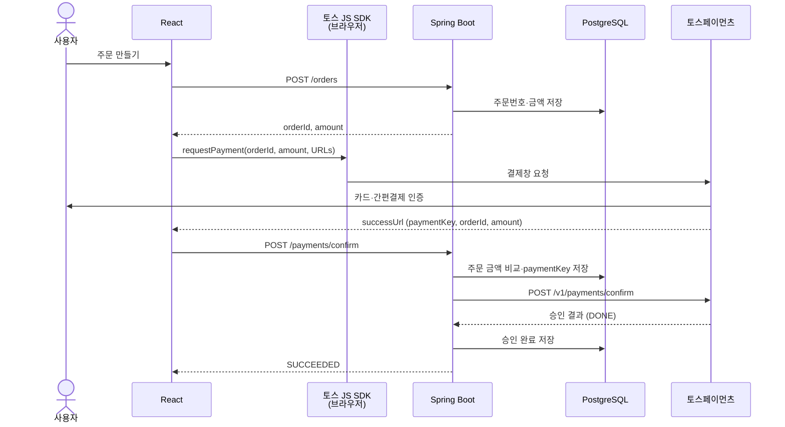

# Payment Service

토스페이먼츠의 기본 결제 흐름을 배우는 Spring Boot + React MVP입니다. **티셔츠 1장, 10,000원 주문 → 결제수단 인증 → 서버 승인 → 결과 조회**만 다룹니다.

먼저 [기본 결제 흐름](docs/payment-domain.md)을 읽고, [코드 읽는 순서](docs/code-reading-guide.md)대로 따라가세요.

## 어떤 토스 연동인가요?

기존 구현에 맞춰 **SDK v2의 카드·간편결제 통합결제창**과 API 개별 연동 테스트 키를 사용합니다. 공식 문서에서는 이 제품을 **결제창(구버전)**이라고 부릅니다. SDK v1을 사용한다는 뜻은 아닙니다.

토스가 신규 연동에 권장하는 제품은 **주문서형·결제창형 결제(기존 결제위젯)**입니다. 이 MVP는 기존 결제창의 공식 가이드를 따르며, 두 제품의 SDK 메서드와 키를 섞지 않습니다. [현재 구현의 연동 가이드](https://docs.tosspayments.com/guides/v2/payment-window/integration), [신규 권장 제품](https://docs.tosspayments.com/guides/v2/payment-widget)

## 기본 결제 흐름



토스 JS SDK는 별도로 배포하는 서버가 아니라 React와 같은 브라우저에서 실행되는 라이브러리입니다. React가 전달한 결제 정보를 토스 형식으로 요청하고 결제창을 여는 역할이 분명하므로 흐름에서는 별도 참여자로 표시했습니다.

**successUrl에 도착한 것은 인증 성공입니다.** 서버가 승인 API의 결과를 확인하고 저장해야 결제 완료입니다. 인증에 실패하면 failUrl로 돌아와 오류를 표시하며 승인 API를 호출하지 않습니다.

서버는 브라우저의 금액을 DB의 주문 금액과 비교하고, 토스에는 DB의 금액으로 승인을 요청합니다. 클라이언트 키는 브라우저에서 사용하고 시크릿 키는 서버에만 둡니다.

## 실행하기

준비: Java 21, Node.js 22.18 이상, npm, 실행 중인 Docker Desktop.

### 1. PostgreSQL과 pgAdmin

```powershell
docker compose up -d
```

### 2. 토스 키 설정 후 백엔드 실행

토스 개발자센터에서 **같은 테스트 상점의 API 개별 연동 키**를 가져옵니다. 키를 설정한 터미널에서 서버를 실행하세요.

```powershell
$env:TOSS_CLIENT_KEY = 'test_ck_로 시작하는 클라이언트 키'
$env:TOSS_SECRET_KEY = 'test_sk_로 시작하는 시크릿 키'
.\gradlew.bat bootRun
```

macOS/Linux에서는 `export TOSS_CLIENT_KEY='...'`, `export TOSS_SECRET_KEY='...'`를 설정하고 `./gradlew bootRun`을 실행합니다.

키가 둘 다 없으면 주문 생성·조회만 가능합니다. 이 프로젝트는 개별 연동 테스트 키만 허용하므로 `live_` 키나 주문서형·결제창형용 `test_gck_`, `test_gsk_` 키를 넣으면 시작 시 검증에 실패합니다. 시크릿 키를 프런트엔드나 Git에 넣지 마세요.

### 3. 다른 터미널에서 프런트엔드 실행

```powershell
cd frontend
npm ci
npm run dev
```

| 화면 | 주소 |
| --- | --- |
| 테스트 스토어 | [127.0.0.1:5173](http://127.0.0.1:5173) |
| Swagger UI | [127.0.0.1:8080/swagger-ui.html](http://127.0.0.1:8080/swagger-ui.html) |
| pgAdmin | [127.0.0.1:5050](http://127.0.0.1:5050) |

pgAdmin 로컬 계정은 `admin@payment-service.com` / `payment_admin_local`입니다. Vite가 API 요청을 Spring Boot의 8080 포트로 전달합니다.

스토어에서 주문을 만들고 테스트 결제를 진행하세요. 인증 후 바로 승인하며, 결과 화면과 주문 조회의 상태가 같은지 확인합니다. 개인 테스트 상점 키라면 개발자센터 결제내역도 함께 확인할 수 있습니다. 테스트 키로 진행한 결제는 실제 청구되지 않습니다.

## API와 상태

| Method | Endpoint | 역할 |
| --- | --- | --- |
| POST | `/orders` | 서버가 정한 상품·금액으로 주문 생성 |
| GET | `/orders/{orderId}` | DB에 저장된 주문·결제 조회 |
| GET | `/payment-config` | 공개 클라이언트 키와 결제 가능 여부 |
| POST | `/payments/confirm` | 인증 결과 검증 후 토스 승인 |
| POST | `/payments/{orderId}/reconcile` | 불명확한 결과를 토스에서 다시 조회 |

승인 요청은 다음 세 값을 받습니다. `paymentKey`는 실제 테스트 결제창의 인증 결과를 사용합니다.

```json
{
  "orderId": "서버가 생성한 주문번호",
  "paymentKey": "토스 인증 결과로 받은 키",
  "amount": 10000
}
```

아래는 **우리 서비스의 상태**입니다. 토스 원본 상태는 응답의 `pgStatus`에 따로 담습니다.

| 상태 | 의미 |
| --- | --- |
| READY | 주문 생성 후, 서버 승인 요청 전 |
| PROCESSING | 승인 요청 정보를 저장했고 처리 중 |
| SUCCEEDED | 주문·키·금액·통화와 토스 DONE 결과를 확인하고 저장 |
| FAILED | 명시적인 카드 거절 또는 토스 ABORTED·EXPIRED 확인 |
| UNKNOWN | 통신 오류 등으로 결과 재확인 필요 |

승인·재확인 API는 완료 시 200, 처리 중·미확정 시 202, 확정 실패 시 422와 주문 본문을 반환합니다. 일반 입력 오류·없는 주문·충돌·설정 및 저장 장애는 `{code, message}` 형식으로 400·404·409·503을 반환합니다.

타임아웃은 실패로 단정하지 않습니다. 먼저 **저장된 결과 조회**, 필요하면 **PG 결과 재확인**을 누르세요. 재확인은 조회 API만 호출하며 새 승인을 요청하지 않습니다. 조회도 불명확하면 UNKNOWN으로 남습니다.

## MVP에서 지키는 규칙

- 비회원이므로 공식 SDK의 `ANONYMOUS`를 사용합니다.
- 주문 금액과 `paymentKey`를 서버에 저장하고 승인 전후 정보를 검증합니다.
- `CARD` 통합결제창의 카드·간편결제를 처리합니다. 간편결제는 계좌·포인트를 사용할 수도 있습니다.
- 같은 승인 요청은 저장된 결과를 반환합니다. 다른 결제 키로 기존 주문의 결제를 교체하지 않습니다.
- UUID 주문번호를 토스의 `Idempotency-Key`로 사용합니다.
- 토스 [타임아웃 가이드](https://docs.tosspayments.com/resources/glossary/timeout)에 따라 API 응답 대기는 60초로 설정합니다.
- 토스 호출 전후의 DB 저장을 분리하고, 유일성 제약과 `@Version`으로 중복·동시 저장을 검사합니다.

주문 테이블 5개 컬럼, 결제 테이블 8개 컬럼을 사용합니다. DB 마이그레이션과 상세 동작은 [코드 읽는 순서](docs/code-reading-guide.md)에 있습니다.

이 프로젝트는 로그인·주문 접근 권한이 없는 로컬 학습 예제입니다. 취소·환불·가상계좌·빌링·웹훅·자동 복구는 구현 범위에 포함하지 않습니다.

## 테스트

Docker가 켜진 상태에서 백엔드 테스트와 실행 파일을 빌드합니다.

```powershell
.\gradlew.bat test bootJar
```

통합 테스트는 Testcontainers의 별도 PostgreSQL을 사용합니다. 토스 응답은 모의 응답이며 실제 결제를 만들지 않습니다. 리포트는 `build/reports/tests/test/index.html`입니다.

```powershell
cd frontend
npm test
npm run build
```

프런트엔드는 Node 내장 테스트로 인증 복귀 URL 처리를 확인하고, TypeScript 검사와 Vite 빌드를 수행합니다. 실제 테스트 상점의 카드·간편결제 인증은 브라우저에서 별도로 확인해야 합니다.

## 기술과 파일

Java 21 / Spring Boot 4.1.1 / JPA / PostgreSQL 18 / Flyway / React 19 / TypeScript 7 / Vite 8을 사용합니다.

- `order/`: 주문 생성·조회
- `payment/`: 승인 흐름·저장·수동 재확인
- `gateway/TossPaymentClient.java`: 토스 승인·조회 HTTP 호출
- `frontend/src/payments/`: 공식 SDK 호출·복귀 URL 처리
- `frontend/src/pages/`: 스토어·결제 결과 화면

## 문서

- [기본 결제 흐름과 MVP 범위](docs/payment-domain.md)
- [코드 읽는 순서](docs/code-reading-guide.md)
- [Java·JPA 개념](docs/java-jpa-notes.md)
- [JPA에서 DB까지의 처리 경로](docs/jpa-database-pipeline.md)
- [로컬 개발 환경](docs/environment-configuration.md)
- [환경변수 설정](docs/environment-variables.md)
- [토스 결제창 SDK](https://docs.tosspayments.com/sdk/v2/js/payment)
- [토스 API 명세](https://docs.tosspayments.com/reference)

종료할 때 Spring Boot와 Vite 터미널에서 Ctrl+C를 누르고 `docker compose down`을 실행합니다. Docker 볼륨에 DB 데이터가 유지됩니다.
