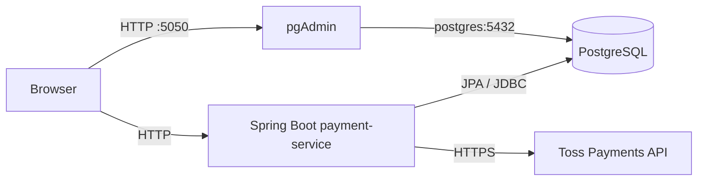

# Payment Service

토스페이먼츠 결제 승인 흐름을 독립 서비스로 구현한 Spring Boot 학습용 MVP입니다. 주문 생성부터 결제 승인, 멱등 처리, 불명확한 결제 결과의 재확인까지 다룹니다.

> 이 프로젝트는 로컬 개발과 학습을 위한 예제입니다. 인증과 주문별 접근 제어가 없으므로 그대로 운영 환경에 배포하지 마세요.

## 주요 기능

- 서버가 상품, 수량, 금액을 결정하는 주문 생성
- 토스페이먼츠 테스트 API를 이용한 카드 결제 승인
- 주문별 결제 1건 및 결제 키 유일성 보장
- `Idempotency-Key`를 이용한 중복 승인 방지
- 데이터베이스 트랜잭션과 외부 PG 호출 분리
- 처리 제한 시간이 지난 결제의 결과 재확인
- Swagger UI 기반 API 문서
- PostgreSQL, pgAdmin을 포함한 Docker Compose 개발 환경
- Testcontainers 기반 통합 테스트

## 기술 스택

| 구분 | 기술 |
| --- | --- |
| Language | Java 21 |
| Framework | Spring Boot 4.1.1, Spring MVC, Spring Data JPA |
| Database | PostgreSQL 18, Flyway |
| API documentation | OpenAPI 3, Swagger UI, springdoc-openapi |
| Test | JUnit 5, Spring Boot Test, Testcontainers |
| Local infrastructure | Docker Compose, pgAdmin 4 |
| Payment gateway | Toss Payments API |

## 아키텍처



애플리케이션은 PostgreSQL을 영속 저장소로 사용하고, 결제 승인과 결과 조회가 필요할 때만 토스페이먼츠 API를 호출합니다. pgAdmin은 애플리케이션과 별개인 로컬 데이터베이스 관리 도구입니다.

## 시작하기

### 사전 요구사항

- Java 21
- Docker Desktop 또는 Docker Engine과 Docker Compose

### 1. 저장소 복제

```powershell
git clone https://github.com/lee-gimoon/payment-service.git
cd payment-service
```

### 2. 로컬 인프라 실행

```powershell
docker compose up -d
```

이 명령은 PostgreSQL과 pgAdmin을 실행합니다. 데이터는 Docker 볼륨에 보존되므로 `docker compose down` 후 다시 실행해도 유지됩니다.

### 3. 토스페이먼츠 테스트 키 설정

주문 생성과 조회만 확인할 때는 생략할 수 있습니다. 실제 결제 승인 흐름을 실행하려면 토스페이먼츠 개발자센터의 같은 테스트 상점에서 발급한 **API 개별 연동 키**를 설정하세요.

```powershell
$env:TOSS_CLIENT_KEY = 'test_ck_로 시작하는 클라이언트 키'
$env:TOSS_SECRET_KEY = 'test_sk_로 시작하는 시크릿 키'
```

macOS와 Linux에서는 다음과 같이 설정합니다.

```bash
export TOSS_CLIENT_KEY='test_ck_로 시작하는 클라이언트 키'
export TOSS_SECRET_KEY='test_sk_로 시작하는 시크릿 키'
```

결제위젯 키인 `test_gck_`와 `test_gsk_`는 사용할 수 없습니다. 키를 소스 코드나 Git에 커밋하지 마세요.

### 4. 애플리케이션 실행

```bash
./gradlew bootRun
```

Windows PowerShell에서는 다음 명령을 사용합니다.

```powershell
.\gradlew.bat bootRun
```

실행 후 다음 주소를 사용할 수 있습니다.

| 서비스 | 주소 | 설명 |
| --- | --- | --- |
| Store | [http://127.0.0.1:8080](http://127.0.0.1:8080) | 결제 흐름을 확인하는 웹 화면 |
| Swagger UI | [http://127.0.0.1:8080/swagger-ui.html](http://127.0.0.1:8080/swagger-ui.html) | API 명세 확인 및 직접 호출 |
| pgAdmin | [http://127.0.0.1:5050](http://127.0.0.1:5050) | PostgreSQL 관리 화면 |

pgAdmin의 로컬 기본 로그인 정보는 다음과 같습니다.

```text
Email:    admin@payment-service.com
Password: payment_admin_local
```

## API

자세한 요청과 응답 스키마는 애플리케이션 실행 후 [Swagger UI](http://127.0.0.1:8080/swagger-ui.html)에서 확인할 수 있습니다.

| Method | Endpoint | 설명 |
| --- | --- | --- |
| `POST` | `/orders` | 서버가 정한 상품과 금액으로 주문 생성 |
| `GET` | `/orders/{orderId}` | 저장된 주문 및 결제 상태 조회 |
| `GET` | `/payment-config` | 브라우저용 결제 가능 여부와 클라이언트 키 조회 |
| `POST` | `/payments/confirm` | 결제창 인증 결과를 이용해 결제 승인 |
| `POST` | `/payments/{orderId}/reconcile` | 불명확하거나 제한 시간이 지난 결제 결과 재확인 |

주문 생성 및 조회 예시:

```powershell
$order = Invoke-RestMethod -Method Post http://127.0.0.1:8080/orders
Invoke-RestMethod "http://127.0.0.1:8080/orders/$($order.orderId)"
```

결제 승인 요청 본문:

```json
{
  "orderId": "서버가 생성한 주문번호",
  "paymentKey": "결제창 인증으로 발급된 paymentKey",
  "amount": 10000
}
```

`paymentKey`는 토스페이먼츠 테스트 결제창의 카드 인증을 완료한 뒤 받은 실제 값을 사용해야 합니다.

### 결제 상태

| 상태 | 의미 |
| --- | --- |
| `READY` | 결제 승인 요청 전 |
| `PROCESSING` | 결제 승인 또는 결과 재확인 진행 중 |
| `SUCCEEDED` | 승인 완료 결과 저장 |
| `FAILED` | 명시적인 거절 또는 만료 확인 |
| `UNKNOWN` | 통신 오류나 저장 실패 등으로 결과 재확인 필요 |

일반 오류 응답은 다음 형식입니다.

```json
{
  "code": "INVALID_REQUEST",
  "message": "요청 형식과 값을 확인해주세요."
}
```

주요 HTTP 상태 코드는 `400`, `404`, `409`, `422`, `503`입니다. 결제 결과가 불명확할 때는 재승인하지 않고 결과 재확인 API를 사용합니다.

## 결제 안정성 설계

- 주문 행을 잠근 짧은 트랜잭션에서 결제 시도와 작업 소유권을 저장합니다.
- 데이터베이스 커밋 후 PG를 호출하여 외부 네트워크 요청 중 트랜잭션을 유지하지 않습니다.
- 동일 요청에는 저장된 결과를 반환하고, 다른 `paymentKey`로 기존 주문을 교체하지 않습니다.
- PG 승인 요청에는 결제 시도 UUID를 `Idempotency-Key`로 전달합니다.
- `PROCESSING` 상태가 30초 이상 지속되면 조회 응답에서 `UNKNOWN`으로 표시하고 재확인을 허용합니다.
- 늦게 도착한 이전 작업의 응답이 새 재확인 결과를 덮어쓰지 않도록 작업 UUID를 검사합니다.

자동 재확인 배치, 취소, 환불, 배송, 정산, 상품 관리와 사용자 인증은 현재 범위에 포함하지 않습니다.

## 환경변수

| 변수 | 기본값 | 설명 |
| --- | --- | --- |
| `PAYMENT_DB_URL` | `jdbc:postgresql://localhost:5432/payment_service` | PostgreSQL JDBC URL |
| `PAYMENT_DB_USERNAME` | `payment` | 데이터베이스 사용자 |
| `PAYMENT_DB_PASSWORD` | `payment_local` | 로컬 데이터베이스 비밀번호 |
| `TOSS_CLIENT_KEY` | 없음 | 토스페이먼츠 테스트 클라이언트 키 |
| `TOSS_SECRET_KEY` | 없음 | 토스페이먼츠 테스트 시크릿 키 |
| `PAYMENT_BIND_ADDRESS` | `127.0.0.1` | 애플리케이션 바인딩 주소 |
| `PORT` | `8080` | 애플리케이션 포트 |
| `PGADMIN_DEFAULT_EMAIL` | `admin@payment-service.com` | 최초 pgAdmin 관리자 이메일 |
| `PGADMIN_DEFAULT_PASSWORD` | `payment_admin_local` | 최초 pgAdmin 관리자 비밀번호 |

기본 계정과 비밀번호는 `127.0.0.1`에만 공개되는 로컬 개발 환경 전용입니다. 배포 환경에서는 별도 보안 값과 접근 제어를 사용해야 합니다.

## 테스트

Docker가 실행 중인 상태에서 다음 명령을 사용합니다.

```bash
./gradlew clean test bootJar
```

Windows PowerShell에서는 다음 명령을 사용합니다.

```powershell
.\gradlew.bat clean test bootJar
```

통합 테스트는 Testcontainers가 생성한 별도의 PostgreSQL 컨테이너를 사용하며 로컬 개발 데이터베이스와 분리됩니다. 테스트 PG 응답은 모의 구현을 사용하므로 실제 토스페이먼츠 키가 필요하지 않습니다.

테스트 리포트는 `build/reports/tests/test/index.html`에 생성됩니다.

## 프로젝트 구조

```text
src/main/java/com/example/payment
├── api/          # 공통 API 오류 처리
├── config/       # 애플리케이션, Toss, OpenAPI 설정
├── gateway/      # 토스페이먼츠 API 연동
├── order/        # 주문 도메인과 API
└── payment/      # 결제 승인, 상태 전이 및 재확인

src/main/resources
├── db/migration/ # Flyway 데이터베이스 마이그레이션
└── static/       # 로컬 결제 화면

docker/pgadmin/   # pgAdmin 서버 및 비밀번호 파일
docs/             # 상세 설계와 개발 환경 문서
```

## 문서

- [결제 서비스 개발 계획과 도메인 설계](docs/payment-domain.md)
- [로컬 개발 환경 구성](docs/environment-configuration.md)
- [환경변수 설정 가이드](docs/environment-variables.md)
- [토스페이먼츠 결제창 연동 가이드](https://docs.tosspayments.com/guides/v2/payment-window/integration)
- [토스페이먼츠 API 명세](https://docs.tosspayments.com/reference)

## 로컬 환경 종료

```powershell
docker compose down
```

위 명령은 컨테이너와 네트워크만 제거하고 PostgreSQL 및 pgAdmin 볼륨은 유지합니다. `docker compose down -v`는 로컬 데이터까지 삭제하므로 주의하세요.

문제가 발생하거나 개선을 제안하려면 [GitHub Issues](https://github.com/lee-gimoon/payment-service/issues)를 이용해주세요.
