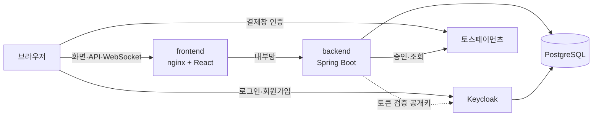

# Payment Service

[](https://github.com/lee-gimoon/payment-service/actions/workflows/ci.yml)

**결제 버튼을 연타해도, 승인 응답이 끊겨도 한 주문에 한 번만 청구되는 쇼핑몰 주문·결제 서비스**

Spring Boot와 React로 만든 티셔츠 쇼핑몰(MODO CLUB)입니다. 서버가 계산한 주문 금액으로 토스페이먼츠 결제를 진행하고, Keycloak 로그인, 관리자 주문·배송 관리, 1:1 실시간 상담을 제공합니다. 토스 **테스트 키**로 동작해 결제는 실제로 청구되지 않습니다.

## 데모

**스토어:** https://frontend-production-ba4e.up.railway.app

| 계정 | 이메일 | 비밀번호 | 둘러볼 기능 |
| --- | --- | --- | --- |
| 일반 회원 | `user@modo-club.shop` | `user` | 장바구니, 배송지, 테스트 결제, 주문 확인·마이페이지, 1:1 문의 |
| 쇼핑몰 관리자 | `admin@modo-club.shop` | `admin` | 관리자 홈, 주문 관리(송장 등록·배송 완료), 상담 답변 |

- 헤더의 `로그인`을 누르면 Keycloak 로그인 화면으로 이동합니다. 일반 회원은 직접 `회원가입`해도 됩니다. 쇼핑몰 관리자는 Keycloak에서 역할을 준 직원 계정이라 회원가입으로 만들 수 없어 위 계정을 제공합니다.
- 방문이 없으면 서버를 재워 두므로, 한동안 접속이 없었다면 `서버를 깨우고 있습니다` 안내와 함께 첫 화면과 로그인 버튼이 뜨기까지 수십 초 걸릴 수 있습니다.
- 여러 사람이 함께 쓰는 공개 계정입니다. **실제 이름·연락처·주소는 입력하지 마세요.** 관리자 계정은 모든 주문의 배송지를 볼 수 있습니다. 다른 사람이 쓸 수 있도록 데모 계정의 비밀번호와 계정 정보는 바꾸지 말아 주세요.

## 시스템 구성


```mermaid
flowchart LR
    Browser["브라우저"] -->|"화면·API·WebSocket"| Front["frontend<br/>nginx + React"]
    Front -->|"내부망"| Back["backend<br/>Spring Boot"]
    Back --> DB[("PostgreSQL")]
    Browser -->|"로그인·회원가입"| KC["Keycloak"]
    KC --> DB
    Browser -->|"결제창 인증"| Toss["토스페이먼츠"]
    Back -->|"승인·조회"| Toss
    Back -.->|"토큰 검증 공개키"| KC
```

- 화면은 API를 같은 주소의 상대 경로로 부르고, nginx가 API와 상담 WebSocket을 내부망의 백엔드로 넘깁니다. 백엔드에는 공개 주소가 없습니다.
- 로그인은 Keycloak(OIDC)이 맡습니다. 백엔드는 비밀번호를 다루지 않고 access token의 서명·발급자·대상을 검증하며, `shop-admin` 역할로 관리자 API를 나눕니다.
- Railway에 배포했으며, 방문이 없으면 백엔드와 Keycloak을 재워 Hobby 플랜 포함 사용량(월 5달러) 안에서 운영합니다([Railway 배포](docs/deployment.md)).

## 중복 결제 방지

결제에서 가장 피해야 할 일은 한 주문에 두 번 청구되는 것입니다. 중복은 아래 세 경우에 생기고, 서버에서 각각 막습니다. 화면의 버튼 비활성화는 탭 두 개나 API 직접 호출로 우회할 수 있어 편의 기능으로만 둡니다.

| 언제 생기나 | 어떻게 막나 |
| --- | --- |
| 결제 버튼 연타, 두 탭에서 동시 결제 | 주문 행을 비관적 잠금(`SELECT … FOR UPDATE`)으로 한 줄로 세우고, 토스 호출 **전에** 주문의 승인 슬롯(`approval_attempt_id`)을 먼저 저장해 두 번째 요청을 `409`로 거부 |
| 새로고침·네트워크 재전송으로 같은 요청이 다시 옴 | 같은 결제 키는 토스를 다시 부르지 않고 저장된 결과를 돌려줌. 토스 승인 요청에는 결제 시도 ID를 `Idempotency-Key`로 보냄 |
| 승인 응답이 끊겨 결과를 모름 | 실패로 단정하고 새 결제를 열면 이중 청구가 될 수 있어 슬롯을 유지해 새 결제를 막음. 복구 작업이 토스 **조회**로 성공·실패를 확정한 뒤에만 슬롯을 비우고, 1시간 넘게 모르면 수동 확인 대상(`REVIEW_REQUIRED`)으로 남김 |
| 위 코드에 버그가 있을 때 | DB 부분 유니크 인덱스로 한 주문에 살아 있는 승인(승인 중·결과 모름·성공)을 하나로 제한. 저장이 먼저이고 토스 호출이 나중이라 DB가 거부하면 토스 호출도 나가지 않음 |

```text
결제 버튼 연타: 요청 A와 B가 동시에 도착
A: 주문 잠금 → 슬롯 비어 있음 → 슬롯에 A를 저장하고 커밋 → 그 뒤에 토스 승인 요청
B: A가 커밋할 때까지 대기 → 슬롯에 A가 있음 → 409 거부 (토스 호출 없음)
```

- **토스 호출은 트랜잭션 밖에서 합니다.** 외부 응답을 기다리는 동안 DB 잠금을 잡지 않고, 롤백해도 되돌릴 수 없는 외부 결제를 DB 트랜잭션에 묶지 않기 위해서입니다. 그래서 "승인 중" 표시를 먼저 커밋하는 순서가 중요합니다.
- 결제창 인증 성공과 서버의 최종 승인을 구분하고, 승인은 서버에 저장된 주문 금액으로만 요청합니다.
- 동시 승인 요청, DB 제약, 결과를 모르는 승인의 복구는 Testcontainers의 실제 PostgreSQL로 통합 테스트합니다([PaymentIntegrationTest](src/test/java/com/example/payment/PaymentIntegrationTest.java)).

다섯 단계의 방어 장치와 부분 유니크 인덱스 설명은 [중복 결제 방지](docs/duplicate-payment-prevention.md)에, 결제 상태와 복구 규칙은 [아키텍처](docs/architecture.md)에 있습니다.

## 그 밖의 설계

| 주제 | 결정 |
| --- | --- |
| 재고 | 주문할 때가 아니라 승인 요청 직전에 확보하고, 승인 실패가 확인될 때만 돌려줍니다. 품절이면 승인을 요청하지 않아 청구되지 않습니다. |
| 주문 금액 | 브라우저 장바구니 값이 아니라 서버의 상품 가격으로 계산하고, 구매 당시 상품 정보와 배송지를 주문에 복사해 보존합니다. |
| 미결제 주문 | 결제 기한(24시간)이 지난 결제 대기 주문은 자동 취소합니다. 결제창을 연 지 30분 안의 주문과 승인 중인 주문은 건드리지 않습니다. |
| 실시간 상담 | 보내기는 HTTP, 알림은 WebSocket(STOMP)으로 나눕니다. 알림은 메시지 저장이 **커밋된 뒤에** 보내 롤백된 메시지가 화면에 뜨지 않게 하고, 재전송은 `clientMessageId`로 한 번만 저장합니다([1:1 상담](docs/chat.md)). |
| 배포 비용 | 서버가 잠들 수 있도록 운영에서만 주기 작업 간격, DB 커넥션 풀, Keycloak 정리 작업 주기를 조정하고, 잠든 서버는 화면이 깨운 뒤 요청을 한 번만 보냅니다([Railway 배포](docs/deployment.md#방문이-없으면-잠드는-방식)). |

## 주요 기능

**고객**

- 상품 목록, 아바타 착용 미리보기, 사이즈별 재고·품절 표시, 장바구니
- Keycloak 회원가입·로그인, 주문한 회원만 주문 조회·결제
- 결제 전 배송지 선택(우편번호 찾기, 기본 배송지)과 배송 메모
- 토스 결제창 결제(카드·국내 간편결제), 결제창을 닫거나 승인이 실패하면 같은 주문으로 재시도
- 마이페이지: 내 주문 내역, 배송지 관리, Keycloak 계정 설정
- 주문 확인 화면의 결제 상태·배송 단계·배송 조회 링크
- 1:1 실시간 문의, 읽음 표시

**쇼핑몰 관리자**

- 관리자 홈, 결제 완료 주문의 송장 등록과 배송 완료 처리
- 상담 관리 화면에서 고객 문의에 실시간 답변
- 직원 계정으로 분리해 주문·결제·마이페이지는 쓸 수 없음

## 기술 구성

| 영역 | 구성 |
| --- | --- |
| 백엔드 | Java 21, Spring Boot 4.1, Spring Data JPA |
| 데이터베이스 | PostgreSQL 18, Flyway |
| 프런트엔드 | React 19, TypeScript, Vite |
| 결제 | 토스페이먼츠 SDK v2 결제창형, 서버 승인·조회 API |
| 인증 | Keycloak 26.7 (OIDC), Spring Security OAuth2 Resource Server, keycloak-js |
| 실시간 상담 | Spring WebSocket(STOMP, 내장 메시지 브로커), @stomp/stompjs |
| 테스트 | JUnit, Testcontainers, Node.js 내장 테스트 |
| 배포 | Docker, nginx, Railway, GitHub Actions |

정확한 의존성 버전은 [build.gradle](build.gradle)과 [package-lock.json](frontend/package-lock.json)에 있습니다.

## 테스트와 CI/CD

- **백엔드:** Testcontainers로 실제 PostgreSQL을 띄워 결제 승인·동시 요청·복구, 재고, 주문 취소, 배송, 상담, WebSocket 권한, 마이그레이션을 통합 테스트합니다.
- **프런트엔드:** 결제창 중복 실행, 결제 결과 복원, 상담 재연결과 읽음 처리, 잠든 서버 깨우기 등을 Node.js 내장 테스트로 확인합니다.
- **CI/CD:** `main` 푸시와 PR마다 GitHub Actions([ci.yml](.github/workflows/ci.yml))가 백엔드·프런트엔드 테스트와 빌드를 돌립니다. Railway는 이 검사를 통과한 커밋만 배포하고, 새 버전이 상태 확인에 응답해야 교체합니다.

테스트 범위와 수동 결제 확인 절차는 [개발 가이드](docs/development.md)에 있습니다.

## 로컬에서 실행하기

<details>
<summary>준비 사항과 실행 순서</summary>

### 준비 사항

- Java 21
- Node.js 22.18 이상과 npm
- Docker Compose를 사용할 수 있는 실행 중인 Docker

아래 명령은 저장소 루트에서 시작합니다. 백엔드와 프런트엔드는 각각 별도 터미널에서 실행합니다.

### 1. 데이터베이스와 Keycloak 실행

```sh
docker compose up -d
```

PostgreSQL, pgAdmin, Keycloak이 실행됩니다. Keycloak은 첫 시작에 1분쯤 걸리고 메모리를 최대 1.5GB 씁니다. 기본 연결 정보는 [설정 문서](docs/configuration.md)에 있습니다.

Keycloak을 추가하기 전부터 쓰던 DB 볼륨이라면 `keycloak` DB를 한 번 직접 만들어야 합니다. 방법은 [설정 문서의 Keycloak](docs/configuration.md#keycloak)에 있습니다.

처음 백엔드를 시작하면 Flyway가 스키마를 생성하고 초기 상품 10종과 사이즈별 재고를 등록합니다. 기존 DB에는 아직 적용하지 않은 마이그레이션만 실행합니다.

### 2. 토스 설정과 백엔드 실행

결제까지 확인하려면 같은 상점에서 발급한 **주문서형·결제창형 테스트 키 한 쌍**(`test_gck_`, `test_gsk_`)이 필요합니다([토스 API 키 안내](https://docs.tosspayments.com/reference/using-api/api-keys)). 키 없이 실행하면 상품·주문 API는 동작하지만 화면의 결제 버튼은 비활성화됩니다.

PowerShell:

```powershell
$env:TOSS_CLIENT_KEY = 'test_gck_REPLACE_WITH_YOUR_KEY'
$env:TOSS_SECRET_KEY = 'test_gsk_REPLACE_WITH_YOUR_KEY'
.\gradlew.bat bootRun
```

macOS / Linux:

```sh
export TOSS_CLIENT_KEY='test_gck_REPLACE_WITH_YOUR_KEY'
export TOSS_SECRET_KEY='test_gsk_REPLACE_WITH_YOUR_KEY'
./gradlew bootRun
```

키 값은 발급받은 테스트 키로 바꿉니다. `.env` 파일은 자동으로 읽지 않으므로 터미널이나 IDE 실행 설정에 지정하고, 시크릿 키는 서버에만 둡니다. 나머지 환경변수는 [설정 문서](docs/configuration.md)에 있습니다.

### 3. 프런트엔드 실행

저장소 루트에서 별도 터미널을 열어 실행합니다.

```sh
cd frontend
npm ci
npm run dev
```

Vite 개발 서버가 API 요청을 백엔드 8080 포트로 전달합니다. 테스트 회원 계정은 [로그인과 회원](docs/authentication.md#로컬-계정)에 있습니다.

### 접속 주소

| 서비스 | 기본 주소 | 제공 프로세스 |
| --- | --- | --- |
| 스토어 | [http://127.0.0.1:5173](http://127.0.0.1:5173) | 프런트엔드 개발 서버 (Vite) |
| Swagger UI | [http://127.0.0.1:8080/swagger-ui.html](http://127.0.0.1:8080/swagger-ui.html) | 백엔드 (Spring Boot) |
| OpenAPI JSON | [http://127.0.0.1:8080/v3/api-docs](http://127.0.0.1:8080/v3/api-docs) | 백엔드 (Spring Boot) |
| pgAdmin | [http://127.0.0.1:5050](http://127.0.0.1:5050) | Docker Compose의 pgAdmin 컨테이너 |
| Keycloak 관리 콘솔 | [http://127.0.0.1:8081/admin](http://127.0.0.1:8081/admin) | Docker Compose의 Keycloak 컨테이너 |

스토어 화면의 상품 기능은 백엔드와 PostgreSQL, 로그인과 주문·결제 기능은 Keycloak까지 실행해야 합니다.

### 테스트와 빌드

Docker가 실행 중인 상태에서 백엔드를 검증합니다. macOS / Linux에서는 `./gradlew test bootJar`를 씁니다.

```powershell
.\gradlew.bat test bootJar
```

프런트엔드는 `frontend/`에서 실행합니다.

```sh
npm test
npm run build
```

### 종료

백엔드와 프런트엔드는 실행한 터미널에서 `Ctrl+C`로 종료합니다. PostgreSQL, pgAdmin, Keycloak은 저장소 루트에서 중지합니다. DB와 회원 데이터는 유지됩니다.

```sh
docker compose stop
```

</details>

## 문서

| 문서 | 내용 |
| --- | --- |
| [아키텍처](docs/architecture.md) | 결제 도메인 그림, 핵심 규칙, 상태, 재고, 복구 정책, 설계 결정 |
| [중복 결제 방지](docs/duplicate-payment-prevention.md) | 같은 주문의 중복 승인을 막는 5단계 |
| [API](docs/api.md) | 엔드포인트, 요청 예시, 응답 상태와 오류 |
| [1:1 상담](docs/chat.md) | 고객·관리자 상담의 규칙, 테이블, 메시지 저장 순서, WebSocket 실시간 전달과 재연결 |
| [WebSocket 주소와 STOMP 프레임](docs/websocket-basics.md) | `/ws` 연결 주소, 연결 안의 구독 채널과 STOMP 프레임, 요청·응답 순서 그림 |
| [Spring이 WebSocket 설정을 읽는 방식](docs/websocket-configuration.md) | `@EnableWebSocketMessageBroker`부터 채팅 알림까지, Spring이 설정 클래스를 찾아 STOMP 브로커를 만드는 순서 |
| [로그인과 회원](docs/authentication.md) | 로그인 기술 기초(OAuth 2.0·OIDC·JWT), 로그인 흐름, 테스트 계정, realm 설정 |
| [설정](docs/configuration.md) | 환경변수, 토스 키, 로컬 DB·pgAdmin·Keycloak 연결 |
| [개발 가이드](docs/development.md) | 테스트, 빌드, CI, 스키마 변경, 기여 시 확인 사항 |
| [Railway 배포](docs/deployment.md) | 운영 서비스 구성, 방문이 없으면 잠드는 방식, Railway 설정 순서, 비용 |
| [UI 디자인 기준](DESIGN.md) | 현재 화면의 스타일과 결제 문구 |

## 한계와 다음 단계

- 취소·환불, 택배사 배송 추적 연동, 재고 보충·수정 기능은 아직 없습니다.
- 주문 생성에는 멱등키가 없어, 장바구니에서 주문을 따로 두 번 만들면 주문이 두 개 생깁니다. 중복 결제 방지는 같은 주문 안에서 적용됩니다.
- 메일 서버를 연결하지 않아 이메일 인증과 비밀번호 찾기가 없습니다.
- 토스 테스트 키로만 동작하며, 서버가 운영 키를 거부합니다.
