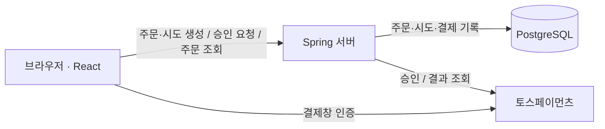
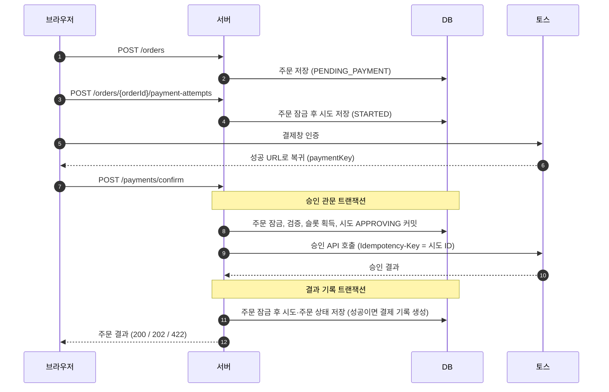
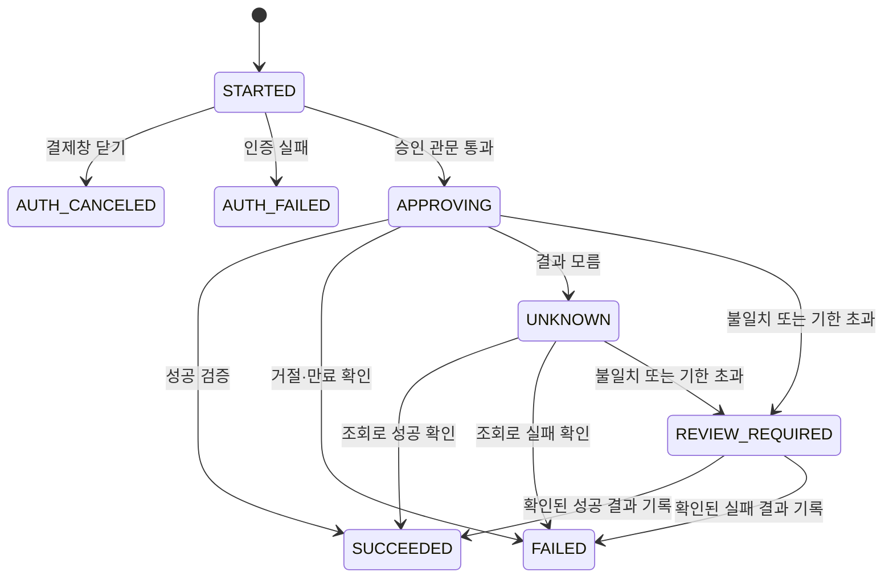

# 아키텍처

이 문서는 결제 도메인의 규칙과 그 규칙을 지키는 구현을 설명한다. 요청·응답 계약은 [API 문서](api.md), 실행 설정은 [설정 문서](configuration.md)를 참고한다.

## 목표와 범위

같은 주문의 중복 승인을 막고, 승인 결과를 모를 때 새 결제를 열지 않는 것이 핵심이다. 주문에는 여러 결제 시도가 생길 수 있지만, 진행 중·미확정·성공 시도는 하나만 허용한다. 승인 성공을 검증하면 주문당 하나의 결제 기록을 남긴다.

DB 제약은 로컬 데이터의 중복을 막는다. 외부 PG 승인과 DB 저장은 별도 작업이므로, DB의 유니크 제약만으로 외부 청구를 보장할 수는 없다. 이 서비스는 승인 전 상태 저장, 중복 승인 요청 차단, PG 조회를 통한 복구를 함께 사용한다.

- **지원:** 원화(`KRW`) 단일 전액 결제, 토스 결제창형 카드·국내 간편결제, 토스 테스트 키.
- **중복 방지 범위:** 같은 주문번호. `POST /orders`는 같은 장바구니 요청을 하나의 주문으로 합치지 않으므로, 두 탭에서 각각 주문하면 서로 다른 주문이 된다.
- **구현하지 않은 것:** 서비스 로그인과 주문 조회 권한, 배송, 재고 예약·차감, 상품 관리 API, 결제 취소·환불, 토스 웹훅, 수동 확정용 관리자 API.

## 구성



브라우저가 전달한 인증 성공 정보만으로 주문을 결제 완료로 처리하지 않는다. 서버가 저장한 주문 금액과 토스 승인 결과를 검증한 뒤 상태를 확정한다. Spring 내부의 복구 스케줄러도 토스를 조회하고 같은 결과 기록 서비스를 사용한다.

## 용어

| 용어 | 뜻 |
| --- | --- |
| 인증 | 구매자가 토스 결제창에서 결제수단 사용을 확인하는 절차. 서비스 로그인이 아니다. 성공하면 결제 키(`paymentKey`)를 전달받아 서버 승인을 요청한다. |
| 승인 | 서버가 시크릿 키로 토스 승인 API를 호출하는 것. 현재 서비스가 외부 결제 승인을 요청하는 지점이다. |
| 결제 시도 | 결제창을 열기 전에 만드는 기록(`PaymentAttempt`). 인증부터 승인 확정까지 담으며, 애플리케이션의 승인 호출은 시도마다 최대 한 번이다. |
| 결제 기록 | 검증한 승인 성공을 저장하는 `Payment`. 성공한 시도에 대해서만 만들며 주문당 최대 하나다. PG 결제와 DB 기록 사이에는 일시적인 차이가 생길 수 있다. |
| 승인 관문 | 주문 잠금 아래에서 승인 요청을 검증하고, 승인 슬롯을 잡아 `APPROVING`을 커밋하는 단계(`PaymentPreparationService`). |
| 승인 슬롯 | 주문의 `approval_attempt_id`. 진행 중이거나 성공한 승인의 시도 ID이며 주문당 하나다. |
| 미확정 | 승인을 요청했지만 결과가 확정되지 않은 상태. `APPROVING`, `UNKNOWN`, `REVIEW_REQUIRED`가 해당한다. |
| 복구 작업 | 미확정 승인을 토스 조회로 확정하는 주기 작업(`PaymentRecoveryService`). |

## 핵심 규칙

| 규칙 | 지키는 장치 |
| --- | --- |
| 한 주문에 진행 중이거나 성공한 승인은 하나뿐이다. | 주문 행 잠금, 주문의 승인 슬롯, DB 부분 유니크 인덱스 |
| 한 주문의 결제 기록은 하나뿐이다. | `payments.order_id` 유니크 제약. 성공 확정과 같은 트랜잭션에서만 결제 기록 생성 |
| 승인 요청을 커밋한 뒤에만 토스 승인을 호출한다. | 승인 관문 트랜잭션을 커밋한 뒤 트랜잭션 밖에서 호출 |
| 금액·주문은 서버 저장값만 사용한다. | 시도에 주문 금액을 복사, 요청 금액은 비교에만 사용, 토스 응답과 대조 |
| 결과를 모르면 실패가 아니다. | 미확정 시도는 슬롯을 유지, `FAILED`는 토스가 거절·만료를 확인할 때만 기록 |
| 확정된 결과는 바뀌지 않는다. | 도메인 상태 전이 검사, 결과 기록 시 종료 상태 무시 |
| 같은 시도의 승인 API를 다시 호출하지 않는다. | 같은 주문·시도·결제 키의 재요청은 저장 결과 반환 또는 PG 조회. 최초 승인 호출에 시도 ID를 토스 `Idempotency-Key`로 전송 |

## 데이터 모델

| 모델 / 테이블 | 책임 | 결제 관련 주요 컬럼 |
| --- | --- | --- |
| `Product` / `products` | 상품 카탈로그. 초기 상품은 10개이며 새 주문에는 `active = true`인 상품만 사용한다. | — |
| `PurchaseOrder` / `purchase_orders` | 주문번호, 서버가 계산한 총액·통화·총수량, 결제창 요약명, 주문 상태 | `status`, `approval_attempt_id`, `paid_at` |
| `OrderItem` / `purchase_order_items` | 상품 ID와 주문 당시 상품명·단가·사이즈·수량, 항목 순서 | — |
| `PaymentAttempt` / `payment_attempts` | 결제 시도. 인증 결과, 승인 요청, 토스가 알려준 증거와 확정 결과. 진행 중·미확정·실패 상태는 여기에만 있다. | `status`, `amount`, `currency`, `payment_key`, `approval_requested_at`, `last_checked_at`, `pg_*`, `error_code` |
| `Payment` / `payments` | 검증된 승인 성공의 기록. 성공한 시도의 결제 키, 승인 금액·통화, PG 승인 시각을 남긴다. 현재 상태 전이나 취소·환불 정보는 없다. | `order_id`, `attempt_id`, `payment_key`, `amount`, `currency`, `approved_at` |

주문 요청은 상품 ID·사이즈·수량만 받는다. `OrderService`가 판매 중인 상품의 DB 가격으로 총액을 계산하고 주문과 항목을 한 트랜잭션에서 저장한다. 주문 금액은 이후 바꾸지 않으며, 주문 당시 상품명과 단가는 `OrderItem`에 따로 저장한다.

서버 승인 요청 전에는 DB 시도에 결제 키가 없다. 승인 관문을 통과할 때 결제 키와 승인 요청 시각을 기록한다. 브라우저가 인증 후 돌아오지 않거나 인증 결과 기록에 실패하면 `STARTED`가 남을 수 있으며, 이 상태는 승인 슬롯을 점유하지 않는다. 승인이 명확히 실패해 다시 결제할 때는 새 시도를 만든다. 같은 주문에 여러 시도와 실패한 승인이 남을 수 있지만 이전 시도를 다시 승인하지는 않는다. 결제 기록은 그중 성공한 시도 하나에 대해서만 생긴다.

`purchase_orders.paid_at`은 서비스가 승인 결과를 저장하며 주문을 결제 완료로 확정한 시각이고, `payments.approved_at`은 PG가 응답한 승인 시각이다. 두 값은 보통 조금 다르며, 조회 복구로 확정한 주문에서는 차이가 커질 수 있다.

```text
payment_attempts (주문 O-100)          payments
a1  AUTH_CANCELED  결제창 닫기
a2  FAILED         카드 거절
a3  SUCCEEDED      승인 성공     →     p1  order=O-100  attempt=a3  19,000원
```

현재 스키마는 [Flyway 마이그레이션](../src/main/resources/db/migration/)을 순서대로 적용한 결과다. V2에서 승인 상태를 시도로 합치고 주문 승인 슬롯을 추가했으며, V3에서 성공한 승인만 담는 `payments`를 만들었다. V4는 V1에서 옮긴 미확정 시도의 완료 시각을 비우고, 종료 상태에만 완료 시각이 있도록 제약을 추가했다. 초기화와 업그레이드는 모두 Flyway가 담당하고, JPA는 엔티티와 테이블의 매핑을 검증한다.

## 결제 승인 흐름



`POST /payments/confirm`을 받으면 `PaymentService.confirm()`이 다음 순서를 조정하며, 자체 DB 트랜잭션은 열지 않는다.

1. **승인 관문** `PaymentPreparationService.prepare()`: 주문 행을 잠그고 요청 금액이 주문 금액과 같은지, 결제 키가 이미 쓰였는지, 주문이 새 승인을 받을 수 있는지, 시도가 이 주문의 `STARTED` 시도인지 검사한다. 통과하면 주문의 승인 슬롯을 잡고(`PAYMENT_IN_PROGRESS`) 시도를 `APPROVING`으로 바꿔 결제 키를 연결한 뒤 커밋한다.
2. **승인 호출** `TossPaymentClient.confirm()`: 시도에 저장된 주문번호·결제 키·금액으로 승인을 호출하고 시도 ID를 `Idempotency-Key`로 보낸다. 응답을 기다리는 동안 DB 트랜잭션이나 주문 잠금은 없다.
3. **결과 기록** `PaymentSettlementService.record()`: 새 트랜잭션에서 주문을 다시 잠그고 결과를 시도와 주문에 함께 기록한다. 검증된 성공이면 주문을 `PAID`로 바꾸고 같은 트랜잭션에서 결제 기록(`payments`)을 만든다. 확인된 실패면 슬롯을 돌려주고 `PENDING_PAYMENT`로 바꾼다. 결과 기록 중 저장에 실패하면 해당 트랜잭션 전체가 롤백되고, 이전에 커밋한 미확정 상태가 남는다.
4. **즉시 조회**: `UNKNOWN`을 정상 저장했으면 같은 요청 안에서 `TossPaymentClient.lookup()`으로 한 번 조회해 다시 기록한다. 그래도 모르면 `UNKNOWN`으로 두고 복구 작업이 이어서 확인한다. 결과 저장 자체가 예외로 끝나면 즉시 조회 단계로 진행하지 않으며, 이후 복구 대상이 된다.

**성공 판정:** 토스 응답의 주문번호·결제 키·금액·통화가 저장값과 같고, 상태가 `DONE`이며, 결제수단이 카드·간편결제이고, 승인 시각이 있어야 한다. 결과 기록 단계에서도 `PaymentAttempt.matchesApproval()`로 금액·통화를 한 번 더 대조하고, 다르면 성공 대신 `REVIEW_REQUIRED`(`PG_EVIDENCE_MISMATCH`)로 기록한다. DB에도 증거가 맞지 않는 `SUCCEEDED`를 거부하는 제약이 있다.

**실패 판정:** 승인 API의 HTTP 4xx 응답에 명시적 카드 거절 코드(`REJECT_CARD_COMPANY`, `INVALID_REJECT_CARD`, `INVALID_STOPPED_CARD`)가 있거나, 주문번호·결제 키와 필수 필드를 확인한 승인·조회 응답의 상태가 `ABORTED`·`EXPIRED`이면 실패로 확정한다. 그 밖의 HTTP 오류, 타임아웃, 불완전한 응답은 `UNKNOWN`이다. `DONE` 응답의 금액·통화·결제수단 불일치는 승인 응답에서 `UNKNOWN`, 재조회에서도 확인되면 `REVIEW_REQUIRED`로 분류한다.

## 상태

주문 상태는 승인 슬롯과 함께 바뀐다. DB 제약은 주문 상태에 따라 슬롯과 완료 시각이 있는지 검사한다.

| 주문 상태 | 승인 슬롯 | 의미 |
| --- | --- | --- |
| `PENDING_PAYMENT` | 비어 있음 | 결제 대기. 새 시도와 새 승인을 받는다. |
| `PAYMENT_IN_PROGRESS` | 진행 중인 시도 | 승인 진행 중이거나 결과를 확인하는 중. 새 시도와 새 승인을 거부한다. |
| `PAID` | 성공한 시도 | 결제 완료. 새로운 승인은 거부하고 같은 승인 요청의 재전송에는 저장된 주문 결과를 반환한다. |

결제 시도의 상태 전이는 다음과 같다.



| 시도 상태 | 슬롯 점유 | 의미 / 후속 동작 |
| --- | --- | --- |
| `STARTED` | 아니요 | 결제창 인증 대기. |
| `AUTH_CANCELED`, `AUTH_FAILED` | 아니요 | 결제창 닫기·인증 실패. 이미 승인된 결제의 취소가 아니다. 같은 주문에서 새 시도로 다시 결제할 수 있다. |
| `APPROVING` | 예 | 승인 요청을 DB에 기록했다. 토스 호출 전 서버가 멈춘 경우도 포함하므로, 이 상태만으로 PG 호출·승인 여부를 알 수 없다. |
| `UNKNOWN` | 예 | 토스 승인 여부를 알 수 없다. 이미 결제됐을 수 있어 실패로 보지 않고 토스 조회로 확정한다. |
| `REVIEW_REQUIRED` | 예 | 조회 결과가 저장값과 다르거나 기한 안에 확정하지 못했다. 토스 결제 내역과 DB를 사람이 대조해야 한다. |
| `SUCCEEDED` | 예 | 토스의 승인 성공을 검증하고 저장했다. 주문이 `PAID`가 되고 결제 기록이 생긴다. |
| `FAILED` | 아니요 | 명시적 거절이나 확인된 `ABORTED`·`EXPIRED`. 같은 주문에서 새 시도로 다시 결제할 수 있다. |

`SUCCEEDED`, `FAILED`, `AUTH_*`는 종료 상태다. `REVIEW_REQUIRED`는 자동 복구 대상에서 제외되며 `UNKNOWN`으로 되돌아가지 않는다. 다만 이미 실행 중인 승인·조회가 늦게 반환하면 결과 기록 서비스가 이를 성공·실패로 확정할 수 있다. 위 다이어그램의 전이는 도메인이 허용하는 범위이며, 별도의 수동 확정 API는 아직 없다.

주문 조회 응답의 `payment`는 가장 최근에 승인을 요청한 시도를 보여준다. 승인을 요청한 시도가 없으면 `payment.status`는 `READY`다. `READY`는 응답에서만 쓰는 값이며 DB에 저장하지 않는다.

## 동시성과 중복 방지

| 상황 | 처리 |
| --- | --- |
| 같은 주문의 서로 다른 승인 요청 | 주문 잠금으로 순서대로 검사한다. 먼저 슬롯을 잡은 요청이 토스를 호출하며, 슬롯을 점유한 동안 다른 시도·키로 들어온 요청은 `PAYMENT_CONFLICT`로 거부한다. |
| 같은 주문·시도·결제 키로 다시 요청 | 금액을 다시 검증한 뒤 현재 주문 결과를 반환하고 토스 승인을 다시 호출하지 않는다. `APPROVING`·`UNKNOWN`이고 마지막 확인 또는 승인 요청 후 1분이 지났으면 승인 대신 조회를 한 번 실행한다. |
| 두 결제창에서 각각 인증 | 인증은 결제가 아니다. 관문을 먼저 통과한 시도만 승인한다. |
| 다른 주문의 시도나 결제 키 사용 | `ATTEMPT_CONFLICT`·`PAYMENT_CONFLICT`로 거부한다. |
| 요청 금액 조작 | `AMOUNT_MISMATCH`로 거부한다. 승인은 항상 시도에 저장된 주문 금액으로 요청한다. |
| 늦게 도착한 인증 취소·실패 알림 | `STARTED` 시도에만 반영하고, 승인 중이거나 확정된 시도는 그대로 둔다. |

시도 생성, 인증 결과 기록, 승인 관문, 결과 기록은 모두 주문 행을 잠근 뒤 시도를 생성하거나 변경한다. 같은 순서를 유지해 이 경로들 사이의 잠금 순서 역전 위험을 줄이며, 잠금은 각 트랜잭션이 끝날 때 풀린다.

DB 제약은 도메인 검사와 별개인 두 번째 방어선이다. 한 주문에 `APPROVING`·`UNKNOWN`·`REVIEW_REQUIRED`·`SUCCEEDED` 시도가 둘 이상 생기는 일, 한 주문에 결제 기록이 둘 이상 생기는 일, 결제 기록이나 슬롯이 다른 주문의 시도를 가리키는 일, 주문 상태와 슬롯·완료 시각의 존재 여부가 어긋나는 일, 시도의 종료 여부와 완료 시각의 존재 여부가 어긋나는 일, 결제 키 중복, 결제 키 없는 승인 상태, 승인 증거가 맞지 않는 `SUCCEEDED` 시도를 막는다.

주문 상태와 해당 시도의 상태를 함께 바꾸고 성공 시 결제 기록을 만드는 책임은 애플리케이션 트랜잭션에 있다. DB 제약이 테이블 간 모든 상태 조합이나 외부 PG 결과까지 검증하는 것은 아니다. `PurchaseOrder`와 `PaymentAttempt`의 `@Version`은 같은 행의 동시 수정을 감지하며, 중복 승인을 막는 주된 장치는 주문 잠금과 승인 슬롯이다.

## 실패와 복구

DB 저장과 토스 승인은 하나의 트랜잭션으로 묶을 수 없다. 토스가 승인한 뒤 서버가 결과를 저장하지 못하면 실제 결과와 저장 상태가 다를 수 있고, DB 롤백이 토스 승인을 취소하지도 않는다. 승인 관문이 토스 호출 전에 `APPROVING`을 커밋하므로, 이때도 주문 슬롯이 남아 새 승인을 막고 무엇을 조회할지 알 수 있다.

복구 스케줄러는 기본 활성화되어 있으며 서버 기동 1분 후 처음 실행한다. 각 실행이 끝난 뒤 1분을 기다리고 다시 실행하는 `fixedDelay` 방식이다. 마지막 확인 시각(`last_checked_at`), 없으면 승인 요청 시각으로부터 1분이 지난 `APPROVING`·`UNKNOWN` 시도를 승인 요청 순으로 최대 50건 조회한다. PG 응답 지연과 대기 건수에 따라 실제 확인까지 걸리는 시간은 늘어날 수 있다.

| 토스 조회 결과 | 처리 |
| --- | --- |
| `DONE`이고 저장값과 일치 | `SUCCEEDED`, 주문 `PAID`, 결제 기록 생성 |
| `ABORTED`·`EXPIRED` | `FAILED`, 주문 슬롯 반환 |
| 주문번호·결제 키 불일치, `DONE`의 금액·통화·결제수단 불일치, `CANCELED`·`PARTIAL_CANCELED` | `REVIEW_REQUIRED` |
| 아직 승인 전, 조회 실패·불완전 응답 | `UNKNOWN` 유지. 승인 요청 후 1시간이 지난 복구 조회에서도 결과가 불명확하면 `REVIEW_REQUIRED` |

복구 작업은 토스 승인을 다시 요청하지 않는다(이유는 [설계 결정](#설계-결정) 5). `REVIEW_REQUIRED` 시도는 자동 복구 대상이 아니며, 주문번호·결제 키·시도 ID와 토스 결제 내역을 대조해 수동으로 확인해야 한다. 확정될 때까지 해당 주문의 새 결제를 막는다. 현재는 이를 처리할 관리자 화면·API가 없어, 자동 복구로 해결되지 않는 주문을 운영자가 안전하게 확정하는 절차가 별도로 필요하다.

복구 조회나 결과 저장에서 예외가 발생하면 해당 시도 ID를 경고 로그에 남기고 다음 건으로 진행한다. 저장하지 못한 상태는 이후 실행에서 다시 조회할 수 있다. `REVIEW_REQUIRED` 전환은 오류 로그에 기록하지만 별도 알림·운영 대기열은 구현하지 않았다.

`GET /orders/{orderId}`와 화면의 "주문 내역 새로고침"은 DB만 읽고 토스를 조회하지 않는다.

## 설계 결정

1. **승인 상태는 시도에만 두고, 성공한 결제는 따로 기록한다.**
   - 이유: 인증·승인 진행 상태와 실패 이력은 시도가 맡고, 검증된 승인 성공만 `payments`에 남긴다. 성공 기록은 시도·주문 상태와 함께 저장하며 `payments.order_id` 유니크 제약으로 로컬 중복 기록을 막는다.
   - 대안: 시도 테이블 하나만 쓰면 구조는 단순하지만 성공한 결제의 별도 기준 기록이 없다. 실패·미확정 상태까지 결제 테이블에 중복 저장하면 두 테이블의 상태를 맞춰야 한다.
2. **주문이 승인 슬롯을 가진다.**
   - 이유: "진행 중이거나 성공한 승인은 하나" 규칙을 잠근 주문 행 하나로 판단할 수 있다. 시도 테이블의 부분 유니크 인덱스는 코드 버그에 대비한 두 번째 방어선이다.
   - 대안: 매번 시도 테이블을 조회해 판단한다. 규칙이 서비스의 쿼리에 흩어진다.
3. **승인 요청을 먼저 커밋하고 트랜잭션 밖에서 토스를 호출한다.**
   - 이유: 토스 응답을 기다리는 동안 잠금을 잡지 않고, 서버가 중간에 멈춰도 무엇을 조회할지 남는다. 순서가 반대면 승인 직후 서버가 멈췄을 때 흔적이 없어 다음 요청이 또 승인할 수 있다.
4. **결과를 모르면 실패로 보지 않는다.**
   - 이유: 응답이 유실돼도 토스에서는 승인됐을 수 있다. 실패로 처리해 새 결제를 열면 중복 청구 위험이 생긴다.
   - 대가: 결과가 확정될 때까지 해당 주문은 결제할 수 없다.
5. **복구 작업은 조회만 하고 승인을 다시 요청하지 않는다.**
   - 이유: 구매자가 기다리지 않고 다른 주문으로 결제했을 수 있다. 지연된 자동 승인은 원치 않는 추가 청구로 이어질 수 있다.
   - 대가: 승인 관문을 통과한 뒤 PG 호출 전에 서버가 멈춰도 자동으로 승인을 이어서 실행하지 않는다. PG가 거절·만료를 확인해 주기 전에는 슬롯을 유지하며, 끝내 확인하지 못하면 수동 확인 대상으로 남는다.

## 알려진 한계

- 주문 소유자를 검증하지 않는다. 주문번호를 아는 사람이 시도를 만들고 유효하지 않은 결제 키로 승인을 요청하면, 조회로 확정하지 못해 그 주문이 `REVIEW_REQUIRED`로 막힐 수 있다. 공개 서비스에는 주문 소유권 검증이 필요하다.
- 같은 장바구니로 별도 생성한 주문의 중복 청구는 막지 않는다. 주문 생성 요청에는 멱등키가 없다.
- `REVIEW_REQUIRED`를 확정하는 도메인 메서드는 있지만 관리자 API와 토스 웹훅 처리는 없다. 현재 테스트 키 전용 구현을 실제 서비스 운영 절차가 갖춰진 것으로 해석하면 안 된다.
- 복구 간격(1분), 재조회 대기(1분), 수동 확인 전환 기준(1시간), 배치 크기(50건)는 코드에 고정되어 있다(`PaymentRecoveryScheduler`, `PaymentRecoveryService`). `PAYMENT_RECOVERY_ENABLED=false`이면 주기 복구만 꺼지고, 승인 요청의 즉시 조회와 오래된 동일 승인 재요청의 조회는 남는다.
- 서버를 여러 대 실행하면 각 서버가 복구 작업을 실행한다. 결과 기록은 주문 잠금과 종료 상태 검사로 보호하지만, 작업 선점이나 분산 스케줄러 잠금이 없어 같은 결제를 중복 조회할 수 있다.
- 승인 완료 후 취소·환불 상태를 다시 확인하지 않는다.
- 결제 완료 뒤 후속 작업(배송·혜택)은 없다. 추가하려면 `PAID` 전환과 후속 작업 전달 사이의 유실·중복 문제를 함께 설계해야 하며, 현재 구조가 외부 후속 작업의 단 한 번 실행을 보장하지는 않는다.
