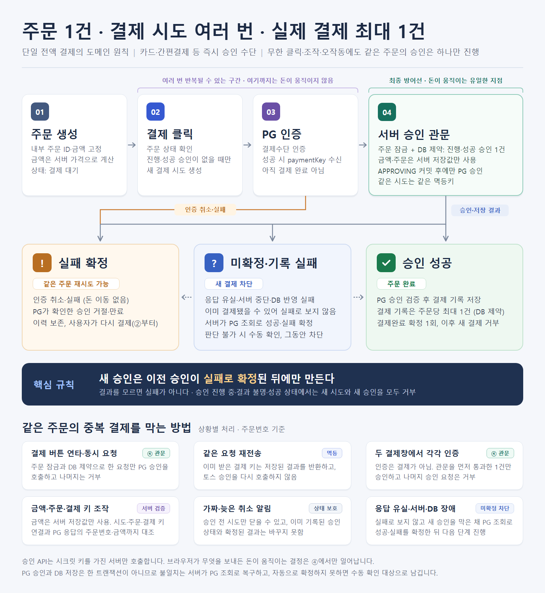
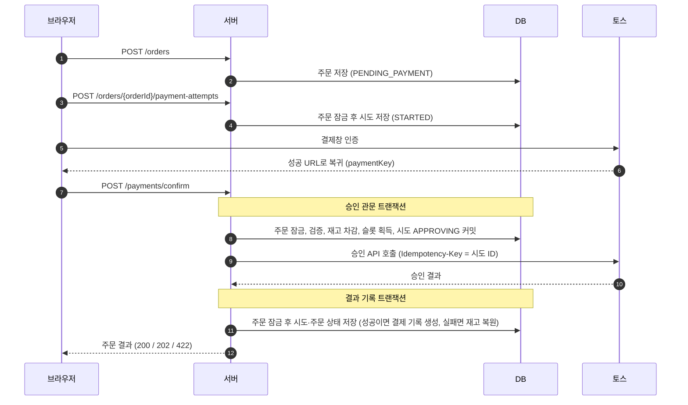
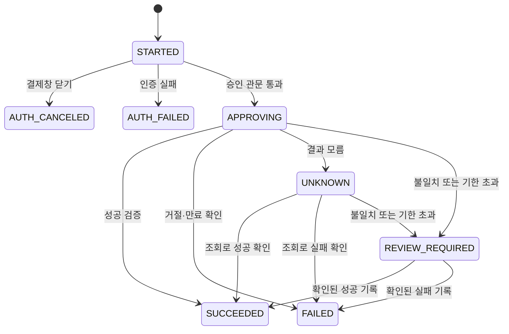

# 아키텍처

결제 도메인의 규칙과 이를 지키는 구현을 설명한다. API 계약은 [API 문서](api.md), 실행 설정은 [설정 문서](configuration.md)를 참고한다.



## 핵심 규칙

주문 하나에 결제 시도는 여러 번 생길 수 있지만, 진행 중이거나 성공한 승인은 하나만 허용한다. 중복 방지 범위는 같은 주문번호이며, 원화 카드·국내 간편결제와 토스 테스트 키만 지원한다.

| 규칙 | 지키는 장치 |
| --- | --- |
| 주문당 진행 중·성공 승인은 하나 | 주문 행 잠금, 주문의 승인 슬롯, DB 부분 유니크 인덱스 |
| 주문당 결제 기록은 하나 | `payments.order_id` 유니크 제약 |
| 승인 요청을 커밋한 뒤에만 토스 호출 | 승인 관문 트랜잭션을 커밋한 뒤 트랜잭션 밖에서 호출 |
| 금액·주문은 서버 저장값만 사용 | 요청 금액은 비교에만 사용, 토스 응답과 대조 |
| 결과를 모르면 실패가 아니다 | 미확정 시도는 슬롯 유지, 토스가 거절·만료를 확인할 때만 `FAILED` |
| 확정된 결과는 바뀌지 않는다 | 도메인 상태 전이 검사, 결과 기록 시 종료 상태 무시 |
| 같은 시도의 승인은 한 번만 호출 | 같은 결제 키 재요청은 저장 결과 반환, 첫 호출에 시도 ID를 `Idempotency-Key`로 전송 |
| 주문은 주문한 회원만 조회·결제 | 주문의 `customer_id`(access token의 `sub`)와 요청 회원 비교, 쓰기 요청은 주문 잠금 아래에서 확인 |
| 쇼핑몰 관리자 계정은 주문·결제하지 않는다 | `shop-admin` 역할이 있는 토큰은 주문·결제·마이페이지 API에서 `403` |
| 배송은 결제 완료 주문만 | 송장 등록 시 주문 잠금 아래에서 `PAID`와 배송지를 확인, `shipments.order_id` 유니크 |
| 재고는 승인 슬롯과 함께 잡고 놓는다 | 승인 관문에서 조건부 UPDATE로 차감, 확인된 실패에서만 복원, `quantity >= 0` 제약 |
| 결제 기한이 지난 결제 대기 주문만 취소한다 | 취소 작업이 주문 잠금 아래에서 상태·기한·최근 결제창을 다시 확인, 상태·슬롯·취소 시각 CHECK 제약 |

- 결제 관련 쓰기 트랜잭션은 모두 주문 행을 먼저 잠근다. 같은 주문의 요청이 한 줄로 처리된다. 방어 단계 전체는 [중복 결제 방지](duplicate-payment-prevention.md)에 정리했다.
- DB 제약은 코드 버그에 대비한 두 번째 방어선이다. 다만 PG 승인과 DB 저장은 한 트랜잭션이 아니므로 DB 제약만으로 외부 청구를 보장하지는 않으며, 불일치는 [복구 작업](#실패와-복구)이 PG 조회로 해소한다.

## 용어

| 용어 | 뜻 |
| --- | --- |
| 인증 | 토스 결제창에서 결제수단을 확인하는 절차. 성공하면 `paymentKey`를 받지만 돈은 움직이지 않는다. |
| 승인 | 서버가 시크릿 키로 토스 승인 API를 호출하는 것. |
| 결제 시도 | 결제창을 열 때마다 만드는 기록(`PaymentAttempt`). 승인은 시도마다 최대 한 번이다. |
| 결제 기록 | 승인 성공을 검증했을 때만 만드는 기록(`Payment`). 주문당 최대 하나다. |
| 승인 관문 | 주문 잠금 아래에서 요청을 검증하고 슬롯을 잡아 `APPROVING`을 커밋하는 단계. |
| 승인 슬롯 | 주문의 `approval_attempt_id`. 진행 중이거나 성공한 승인의 시도 ID다. |
| 미확정 | 승인을 요청했지만 결과가 확정되지 않은 `APPROVING`·`UNKNOWN`·`REVIEW_REQUIRED`. |

## 데이터 모델

| 테이블 | 역할 | 결제 관련 컬럼 |
| --- | --- | --- |
| `products` | 상품 카탈로그(초기 10종) | — |
| `product_stocks` | 상품·사이즈별 남은 수량 | `quantity` |
| `purchase_orders` | 서버가 계산한 주문 금액, 주문한 회원, 주문 상태, 주문할 때 복사한 배송지(`shipping_*`) | `customer_id`, `status`, `approval_attempt_id`, `paid_at`, `canceled_at` |
| `purchase_order_items` | 주문 당시 상품명·단가·사이즈·수량 | — |
| `customer_addresses` | 회원이 마이페이지에서 관리하는 배송지. 회원당 최대 10개, 기본 배송지 하나 | — |
| `shipments` | 결제 완료 주문의 송장과 배송 상태. 주문당 한 건 | — |
| `payment_attempts` | 시도별 인증·승인 상태와 PG 응답 증거 | `status`, `payment_key`, `amount`, `pg_*`, `last_checked_at` |
| `payments` | 검증된 승인 성공만 기록 | `order_id`, `attempt_id`, `payment_key`, `amount`, `approved_at` |

```text
payment_attempts (주문 O-100)          payments
a1  AUTH_CANCELED  결제창 닫기
a2  FAILED         카드 거절
a3  SUCCEEDED      승인 성공     →     p1  order=O-100  attempt=a3  19,000원
```

- 주문 금액은 상품 DB 가격으로 계산하고 이후 바꾸지 않는다.
- 결제 키는 승인 관문을 통과한 시도에만 기록된다.
- `paid_at`은 서버가 결제 완료를 저장한 시각, `approved_at`은 PG 승인 시각이라 보통 조금 다르다.
- 스키마는 [Flyway 마이그레이션](../src/main/resources/db/migration/)이 만든다. 버전별 내용은 [개발 가이드](development.md#데이터베이스와-마이그레이션)에 있다.

## 결제 승인 흐름



1. **승인 관문** (`PaymentPreparationService`): 주문 소유자, 금액, 결제 키 중복, 주문 상태, 시도 소속을 검사한 뒤 재고를 가져가고 슬롯을 잡아 시도를 `APPROVING`으로 커밋한다. 재고가 부족하면 아무것도 바꾸지 않고 거부한다.
2. **승인 호출** (`TossPaymentClient`): 저장된 주문번호·결제 키·금액으로 호출한다. 이때 DB 잠금은 잡지 않는다.
3. **결과 기록** (`PaymentSettlementService`): 시도·주문·결제 기록을 한 트랜잭션에 저장한다. 성공이면 주문 `PAID`와 결제 기록, 확인된 실패면 슬롯과 재고를 반환한다. 저장에 실패하면 모두 롤백되고 시도는 미확정으로 남는다.
4. **즉시 조회**: 결과가 `UNKNOWN`이면 같은 요청에서 한 번 조회한다. 그래도 모르면 복구 작업이 이어받는다.

| 판정 | 조건 |
| --- | --- |
| 성공 | `DONE`이고 주문번호·결제 키·금액·통화가 일치, 카드·간편결제, 승인 시각 있음 |
| 실패 | 4xx 카드 거절 코드(`REJECT_CARD_COMPANY`·`INVALID_REJECT_CARD`·`INVALID_STOPPED_CARD`), 최초 승인 요청에 대한 404 `NOT_FOUND_PAYMENT`(없는 결제 키)·`NOT_FOUND_PAYMENT_SESSION`(인증 세션 만료), 또는 `ABORTED`·`EXPIRED` |
| 수동 확인 | 조회에서도 확인된 불일치(주문번호·결제 키·금액·통화·결제수단), `CANCELED`·`PARTIAL_CANCELED` |
| 미확정 | 그 밖의 오류, 타임아웃, 불완전한 응답 |

## 상태

| 주문 상태 | 승인 슬롯 | 의미 |
| --- | --- | --- |
| `PENDING_PAYMENT` | 비어 있음 | 결제 대기. 새 시도와 새 승인을 받는다. |
| `PAYMENT_IN_PROGRESS` | 진행 중인 시도 | 승인 진행 중이거나 결과 확인 중. 새 시도와 새 승인을 거부한다. |
| `PAID` | 성공한 시도 | 결제 완료. 새 승인을 거부한다. |
| `CANCELED` | 비어 있음 | 결제 기한이 지나 [자동 취소](#미결제-주문-자동-취소)됐다. 새 시도와 새 승인을 `409 ORDER_CANCELED`로 거부한다. |



| 시도 상태 | 슬롯 점유 | 의미 |
| --- | --- | --- |
| `STARTED` | 아니요 | 결제창 인증 대기 |
| `AUTH_CANCELED`, `AUTH_FAILED` | 아니요 | 결제창 닫기·인증 실패. 새 시도로 다시 결제할 수 있다. |
| `APPROVING` | 예 | 승인 요청을 기록했다. 이 상태만으로는 PG 호출 여부를 알 수 없다. |
| `UNKNOWN` | 예 | 승인 여부를 모른다. 이미 결제됐을 수 있어 PG 조회로 확정한다. |
| `REVIEW_REQUIRED` | 예 | 조회 결과가 맞지 않거나 기한 안에 확정하지 못했다. 사람이 확인한다. |
| `SUCCEEDED` | 예 | 승인 성공. 주문이 `PAID`가 되고 결제 기록이 생긴다. |
| `FAILED` | 아니요 | 거절·만료를 확인했다. 새 시도로 다시 결제할 수 있다. |

- `SUCCEEDED`, `FAILED`, `AUTH_*`는 종료 상태이며 이때만 완료 시각(`finished_at`)이 있다.
- 주문 응답의 `payment`는 가장 최근에 승인을 요청한 시도를 보여 주고, 그런 시도가 없으면 `READY`다. 취소된 주문은 `CANCELED`다.

## 재고

재고는 상품·사이즈마다 `product_stocks` 한 행으로 센다. 재고가 빠져 있는 기간은 주문이 승인 슬롯을 잡고 있는 기간과 같다.

| 단계 | 재고 |
| --- | --- |
| 주문 생성, 결제 시도 생성 | 확인만 한다. 부족하면 `409 OUT_OF_STOCK`으로 결제창을 열기 전에 알린다. |
| 승인 관문 | 슬롯을 잡는 트랜잭션에서 뺀다. 한 항목이라도 부족하면 전체를 롤백하고 토스를 호출하지 않는다. |
| `SUCCEEDED` | 뺀 채로 둔다. |
| `FAILED` | 슬롯을 돌려주는 트랜잭션에서 함께 돌려준다. |
| `APPROVING`·`UNKNOWN`·`REVIEW_REQUIRED` | 이미 결제됐을 수 있으므로 결과가 확정될 때까지 돌려주지 않는다. |

- 차감은 남은 수량이 요청 수량 이상일 때만 바꾸는 조건부 UPDATE다. 마지막 1개에 두 주문이 동시에 승인을 요청하면 먼저 행을 잠근 쪽만 성공한다. `CHECK (quantity >= 0)`은 두 번째 방어선이다.
- 주문 행을 먼저 잠그고, 재고 행은 상품 ID·사이즈 순으로 잠가 여러 상품을 담은 주문끼리 교착되지 않게 한다.
- 같은 결제 키의 재요청은 관문이 저장된 시도를 바로 반환하고, 확정된 결과는 다시 기록하지 않는다. 그래서 재고가 두 번 빠지거나 두 번 돌아오지 않는다.
- 재고 행이 없는 사이즈는 품절로 본다. 상품 응답은 품절 여부와 남은 수량을 알려주되, 남은 수량은 한 옵션의 주문 한도인 10까지만 알려 실제 재고량을 드러내지 않는다.

## 배송

배송 상태는 결제 상태와 따로 둔다. 결제 승인·복구 코드는 배송을 모르고, 배송은 `PAID` 주문에서만 시작한다.

| 배송 단계 | 조건 | 바꾸는 쪽 |
| --- | --- | --- |
| 없음 | 결제 완료 전 | — |
| `PREPARING` 상품 준비 중 | `PAID`이고 `shipments` 행이 없음 | 결제 완료 시 자동 |
| `SHIPPED` 배송 중 | 관리자가 택배사·송장번호를 등록 | 관리자 |
| `DELIVERED` 배송 완료 | 관리자가 완료 처리 | 관리자 |

- 송장 등록과 완료 처리는 결제처럼 주문 행을 먼저 잠근다. 같은 주문의 관리자 요청이 겹쳐도 한 줄로 처리한다.
- 배송 중에는 잘못 넣은 송장을 고칠 수 있고, 배송 완료 뒤에는 바꾸지 않는다.
- 택배사 배송 추적 API는 쓰지 않는다. 고객 화면은 택배사 조회 페이지로 연결하고, 배송 완료는 관리자가 직접 처리한다.

## 미결제 주문 자동 취소

주문만 만들고 결제하지 않은 주문은 결제 기한(기본 24시간, `ORDER_UNPAID_EXPIRY_AFTER`)이 지나면 `CANCELED`가 된다. 취소 작업(`UnpaidOrderExpiryService`)은 서버가 켜지고 1분 뒤부터 10분마다 실행되며, 한 번에 오래된 주문부터 최대 100건을 처리한다.

| 취소 조건 | 이유 |
| --- | --- |
| 주문 상태가 `PENDING_PAYMENT` | 승인 중·결과 모름(`PAYMENT_IN_PROGRESS`)은 이미 결제됐을 수 있어 [복구 작업](#실패와-복구)이 확정한다. `PAID`를 되돌리려면 환불이 필요하다. |
| 주문한 지 결제 기한이 지남 | 취소 기준 |
| 최근 30분 안에 연 결제창이 없음 | 고객이 결제창에서 인증하는 중일 수 있다. 토스 인증은 30분 뒤 만료된다. |

- 대상은 조건으로 고른 뒤, 주문마다 주문 행을 잠그고 조건을 다시 확인해 따로 커밋한다. 결제 시작·승인 관문도 같은 주문을 잠그고 상태를 확인하므로, 취소와 결제가 겹쳐도 하나만 성공한다. 한 건이 실패해도 나머지는 처리한다.
- 재고는 승인 관문에서만 빠지므로 결제 대기 주문을 취소해도 돌려줄 재고가 없다. 결제 시도 기록은 그대로 남긴다.
- 취소 전에 연 결제창에서 인증을 마치고 돌아와도 승인 관문이 `409 ORDER_CANCELED`로 거부하고 토스 승인을 호출하지 않는다. 인증만 된 거래는 토스에서 만료되므로 청구되지 않는다.
- 취소된 주문은 다시 결제할 수 없다. 고객은 상품을 다시 담아 새 주문을 만든다.

## 실패와 복구

승인 관문이 PG 호출 전에 `APPROVING`을 커밋하므로, 서버가 중간에 멈추거나 결과를 저장하지 못해도 슬롯이 남아 새 승인을 막고 무엇을 조회할지 알 수 있다.

복구 작업(`PaymentRecoveryService`)은 1분마다 실행되며, 마지막 확인 뒤 1분이 지난 `APPROVING`·`UNKNOWN` 시도를 최대 50건 토스에 조회한다.

| 조회 결과 | 처리 |
| --- | --- |
| `DONE`이고 저장값과 일치 | `SUCCEEDED`, 주문 `PAID`, 결제 기록 생성 |
| `ABORTED`·`EXPIRED` | `FAILED`, 슬롯 반환 |
| 불일치, `CANCELED`·`PARTIAL_CANCELED` | `REVIEW_REQUIRED` |
| 아직 승인 전, 조회 실패 | `UNKNOWN` 유지. 승인 요청 후 1시간이 지나도 모르면 `REVIEW_REQUIRED` |

- 복구 작업은 조회만 하고 승인을 다시 요청하지 않는다.
- `REVIEW_REQUIRED`는 자동 복구 대상이 아니다. 토스 결제 내역과 대조해 사람이 확인해야 하며, 그동안 해당 주문의 새 결제를 막는다.
- 같은 결제 키로 승인 요청이 다시 오면, 1분 넘게 미확정인 시도만 한 번 조회한다.
- 주문 조회(`GET /orders/{orderId}`)는 DB만 읽고 토스를 호출하지 않는다.

## 설계 결정

| 결정 | 이유 | 대가·대안 |
| --- | --- | --- |
| 승인 상태는 시도에 두고, 성공한 결제만 `payments`에 따로 기록 | 상태를 한 곳에서 관리하면서 실제 결제를 별도 기준 기록으로 남긴다. | 테이블 하나로 합치면 실제 결제 기록이 없고, 실패까지 결제 테이블에 두면 두 곳의 상태를 맞춰야 한다. |
| 주문이 승인 슬롯을 가진다 | 잠근 주문 행 하나로 "승인은 하나" 규칙을 판단한다. | 매번 시도 테이블을 조회하면 규칙이 쿼리에 흩어진다. |
| 승인 요청을 먼저 커밋하고 트랜잭션 밖에서 PG 호출 | 응답을 기다리는 동안 잠금이 없고, 서버가 멈춰도 조회할 대상이 남는다. | 순서가 반대면 승인 흔적이 없어 다음 요청이 또 승인할 수 있다. |
| 결과를 모르면 실패로 보지 않는다 | 응답이 유실돼도 PG에서는 승인됐을 수 있다. | 결과가 확정될 때까지 그 주문은 결제할 수 없다. |
| 복구 작업은 조회만 한다 | 사용자가 다른 주문으로 이미 결제했을 수 있어, 늦은 자동 승인은 추가 청구가 된다. | 인증만 된 결제는 PG에서 만료(30분)될 때까지 주문이 막힌다. |
| 재고는 승인 관문에서 빼고 확인된 실패에서만 돌려준다 | 토스 승인 전에 재고를 확보해 청구 뒤 품절을 막고, 슬롯과 같은 잠금·트랜잭션 규칙을 쓴다. | 주문 생성 때 빼면 결제하지 않은 주문이 재고를 계속 잡고, 승인 뒤에 빼면 품절일 때 환불해야 한다. 대신 결제창 인증까지 마친 뒤 품절로 거부될 수 있다(청구는 없다). |

## 알려진 한계

- 주문한 회원 본인이 잘못된 결제 키로 승인을 요청할 때, 토스가 404 `NOT_FOUND_PAYMENT`·`NOT_FOUND_PAYMENT_SESSION`으로 답하면 실패로 확정해 슬롯과 재고를 바로 돌려준다. 그 밖의 응답(예: 그 회원의 다른 주문에서 인증만 해 둔 결제 키)은 `REVIEW_REQUIRED`로 막히고, 확인될 때까지 그 주문의 재고도 붙잡는다. 다른 회원의 요청은 승인 관문에서 거부된다.
- 로그인 도입 전에 만든 주문은 주인(`customer_id`)이 없어 누구도 조회·결제할 수 없다. 미확정 결제는 복구 작업이 계속 확정한다.
- 같은 장바구니로 따로 만든 주문의 중복 결제는 막지 않는다. 주문 생성에는 멱등키가 없다.
- `REVIEW_REQUIRED` 수동 확정 API, 토스 웹훅, 결제 취소·환불이 없다.
- 복구 주기·기한·배치 크기는 코드 상수다. 서버를 여러 대 띄우면 같은 결제를 중복 조회할 수 있다(결과 기록은 안전하다).
- 미결제 주문 취소의 주기(10분)·배치 크기(100건)·결제창 대기(30분)는 코드 상수이고, 결제 기한만 설정값이다. 서버를 여러 대 띄워도 주문 잠금 아래에서 다시 확인하므로 같은 주문을 두 번 취소하지 않는다.
- 고객이 결제 대기 주문을 직접 취소하는 기능은 없다.
- 결과가 미확정이거나 수동 확인 중인 주문은 확정될 때까지 재고를 붙잡는다. 결제 취소·환불이 없으므로 취소에 따른 재고 복원도 없다.
- 재고 보충·수정 API가 없어 재고는 SQL로 바꾼다. 남은 수량 알림, 재입고 알림도 없다.
- 배송지를 받기 전에 만든 주문은 결제를 새로 시작할 수 없고, 이미 결제됐다면 송장을 등록할 수 없다(관리자 목록에 `배송지 없음`으로 남는다).
- 나눠 보내기, 택배사 배송 추적 연동, 배송 알림, 결제 취소·반품, 상품 관리 API는 구현하지 않았다. 로그인 방식은 [로그인과 회원](authentication.md)에 있다.
