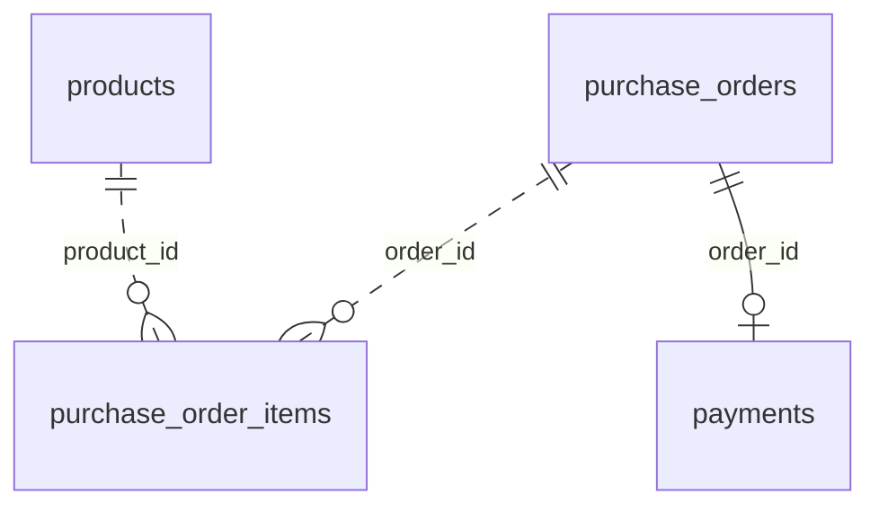

# 상품·주문·결제 도메인

현재 프로젝트는 티셔츠 스토어의 **상품 선택 → 주문 항목 기록 → 테스트 결제**를 구현한다. 회원, 배송, 재고 예약·차감, 관리자 상품 수정 기능은 아직 없다.

## 연결선 기호 읽는 법

이 그림은 관계의 양 끝에 **상대 테이블의 한 행과 연결될 수 있는 행의 수**를 표시하는 까마귀발(Crow's Foot) 표기법이다. 화살표가 아니므로 양쪽 방향으로 읽는다.

| 기호 | 뜻 | 이 그림에서 읽는 예 |
| --- | --- | --- |
| `||` | 반드시 1개 | 주문 항목 한 행은 주문 한 건에 속한다. |
| `o{` | 0개 이상 | 상품 한 종류는 아직 팔리지 않았을 수도 있고, 여러 주문 항목에 등장할 수도 있다. |
| `o|` | 0개 또는 1개 | 주문 한 건에는 결제가 아직 없거나 한 건 있다. |
| `..` (점선) | 비식별 관계: 부모의 키가 자식 기본 키의 일부가 아님 | 주문 항목은 자체 `id`가 기본 키이고 `product_id`·`order_id`는 외래 키다. |
| `--` (실선) | 식별 관계: 부모의 키가 자식의 식별에 쓰임 | 결제의 `order_id`는 주문 외래 키이면서 결제의 기본 키다. |

예를 들어 `purchase_orders ||..o{ purchase_order_items`는 **주문 항목 하나가 속한 주문은 정확히 하나**, **주문 하나에 연결된 항목은 0개 이상**이라는 뜻이다. `products ||..o{ purchase_order_items`도 마찬가지로 항목 하나가 참조하는 상품은 정확히 하나이고, 상품 하나는 여러 항목에서 참조될 수 있다. `purchase_orders ||--o| payments`는 결제 한 건이 주문 한 건에 속하고, 주문 한 건에는 결제가 최대 한 건이라는 뜻이다. 연결선에는 화살표가 없으며, 점선과 실선은 데이터가 흐르는 방향을 나타내지 않는다.

선 옆의 `product_id`, `order_id`는 **연결에 사용하는 외래 키 열 이름**이다. `purchase_order_items`의 `product_id`와 `order_id`, `payments`의 `order_id`가 각각 부모 행을 가리킨다. 특히 `payments.order_id`는 기본 키이기도 해서 한 주문에 결제 두 행을 저장할 수 없다.

그림의 `o{`에서 `0개`는 DB 관계의 허용 범위다. 실제 새 주문은 애플리케이션에서 항목을 최소 1개 넣도록 검사한다. 이전 버전에서 생성된 주문에는 항목이 없을 수 있다.

표기법 참고: [Mermaid ER 다이어그램 문서](https://mermaid.js.org/syntax/entityRelationshipDiagram).

| 테이블 / Java 엔티티 | 한 행의 뜻 | 중요한 값 |
| --- | --- | --- |
| `products` / `Product` | 현재 판매 상품 한 종류 | 상품명, 현재 가격, 판매 여부 |
| `purchase_orders` / `PurchaseOrder` | 주문 한 건 | 주문번호, 총수량, 확정 금액 |
| `purchase_order_items` / `OrderItem` | 그 주문에서 구입한 상품·사이즈 한 줄 | 주문 ID, 상품 ID, 사이즈, 수량, 구입 당시 상품명·단가 |
| `payments` / `Payment` | 주문에 연결된 결제 한 건 | 주문 ID, 결제 키, 승인·취소 상태 |

## 왜 주문 안에 `List<OrderItem>`이 있나요?

주문 `O-1`에 두 티셔츠를 담으면 `purchase_orders`에는 `O-1` 한 행이, `purchase_order_items`에는 `order_id = O-1`인 두 행이 생긴다. **외래 키는 항목 행 각각에 하나씩** 들어 있다. Java에서 그 두 행을 한 주문의 목록으로 보는 것이 `PurchaseOrder.items`다. `@OneToMany(mappedBy = "order")`의 `order`는 `OrderItem.order` 필드를 가리킨다.

반대로 `Product`에는 모든 구입 내역을 담는 `List<OrderItem>`을 두지 않았다. 한 상품의 과거 주문이 계속 늘어나므로 상품을 조회할 때 전체 구입 내역을 읽을 이유가 없기 때문이다.

주문 생성 시에만 항목을 함께 저장한다. 결제 기록인 항목을 목록에서 제거했다는 이유로 삭제하지 않는다. 평소에는 항목을 지연 로딩하고, 주문 응답을 만들 때만 항목과 상품을 함께 조회한다.

## 현재 상품과 구입 당시 값

`OrderItem.product_id`는 `products.id`를 참조한다. 상품 가격·이름이 바뀌어도 과거 주문의 `OrderItem.unit_price`와 `product_name`은 그대로다. 상품을 판매 중지하려면 `products.active = false`로 표시한다. 과거 주문이 참조하는 상품 행을 삭제하는 것은 DB 외래 키가 막는다.

`PurchaseOrder`는 항목의 수량과 단가를 합산해 주문 총수량·금액을 만든다. React가 보낸 가격은 사용하지 않는다. `payments.order_id`도 `purchase_orders.id`를 참조한다. 결제 API가 주문번호로 결제를 다루므로 `Payment`에는 주문 ID만 두고 JPA 양방향 연관관계는 만들지 않았다.

## 운영 범위

이 구조는 **결제 학습용 쇼핑몰의 상품·주문·결제 기반**이다. 실제 판매를 시작하려면 사이즈별 SKU와 재고 예약·차감·해제, 주문 만료, 구매자 인증과 주문 접근 권한, 배송·반품·환불, 관리자 상품 관리, 결제 미확정 건의 운영 대조가 추가로 필요하다. 재고 수치만 넣고 결제 확정 전후 처리 없이 판매 가능하다고 표시하지 않는다.
