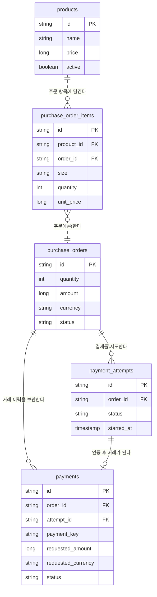

# 상품·주문·결제 도메인

현재 프로젝트는 티셔츠 스토어의 **상품 선택 → 주문 항목 기록 → 테스트 결제**를 구현한다. 회원, 배송, 재고 예약·차감, 관리자 상품 수정 기능은 아직 없다.

위 이미지는 상품·주문 항목만 설명하는 예시이며, 결제 시도와 거래 구조는 위 ERD가 최신이다.

## 주문한 상품은 어디에 있나요?

위 예시에서 주문 `O-100`의 상품은 `purchase_order_items`의 `order_id = O-100`인 두 행이다. `O-200`에는 세 행이 있다. 각 행의 `product_id`는 `products.id`를 가리킨다.

Java에서도 `OrderItem.order`가 `order_id`를 관리한다. `PurchaseOrder`에 항목 목록을 별도로 두지 않고, 주문을 조회할 때 `OrderItemRepository`가 주문번호로 항목을 읽는다. 새 주문을 만들 때는 요청의 상품 ID로 `Product`를 조회하고 총액을 계산한 다음 `PurchaseOrder` 객체를 만든다. 이어서 그 주문과 상품을 받는 `OrderItem` 객체를 만든다. `new OrderItem(...)`은 메모리의 객체 생성이며, 같은 DB 트랜잭션에서 주문과 항목을 저장할 때 각 테이블의 행이 생긴다.

## 현재 상품과 구입 당시 값

`OrderItem.product_id`는 `products.id`를 참조한다. 상품 가격·이름이 바뀌어도 과거 주문의 `OrderItem.unit_price`와 `product_name`은 그대로다. 상품을 판매 중지하려면 `products.active = false`로 표시한다. 과거 주문이 참조하는 상품 행을 삭제하는 것은 DB 외래 키가 막는다.

`OrderService`는 선택한 상품의 서버 가격과 수량으로 주문 총수량·금액을 계산해 `PurchaseOrder`에 저장한다. `OrderItem`은 같은 상품의 이름·단가를 구입 당시 값으로 보존한다. React가 보낸 가격은 사용하지 않는다.

`purchase_orders.status`는 주문의 `PENDING_PAYMENT`·`CONFIRMED`·`CANCELED`를 기록한다. 결제창을 열 때 `payment_attempts`에 `STARTED`를 저장하고, 인증 취소·실패도 이 행에 남긴다. 인증에 성공해 `paymentKey`를 받으면 `payments`에 거래를 만들고 `attempt_id`로 연결한다. `payments.id`는 자체 기본 키이며 `order_id`는 외래 키다. 명확하게 실패한 거래는 남겨두고 같은 주문에 새 거래를 만들 수 있다. 성공·확인 필요·취소된 거래가 있으면 중복 승인을 막는다. 승인된 결제의 취소와 결제창 닫기는 서로 다른 상태다.

`purchase_orders.amount`와 `currency`는 주문 확정 시점의 합계·통화다. 각 거래는 `requested_amount`와 `requested_currency`도 저장하고, PG에서 확인한 값은 `pg_amount`와 `pg_currency`에 별도로 남긴다. DB의 복합 외래 키는 결제 거래와 결제 시도가 같은 주문을 가리키게 한다.

## 운영 범위

이 구조는 **결제 학습용 쇼핑몰의 상품·주문·결제 기반**이다. 실제 판매를 시작하려면 사이즈별 SKU와 재고 예약·차감·해제, 주문 만료, 구매자 인증과 주문 접근 권한, 배송·반품·환불, 관리자 상품 관리, 결제 미확정 건의 운영 대조가 추가로 필요하다. 재고 수치만 넣고 결제 확정 전후 처리 없이 판매 가능하다고 표시하지 않는다.
