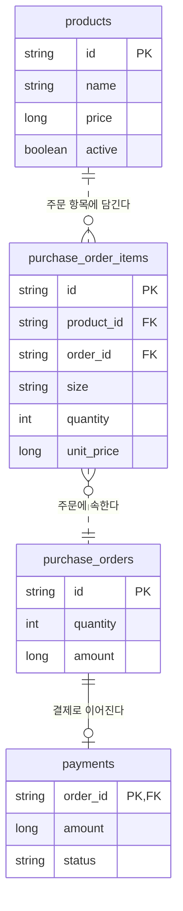
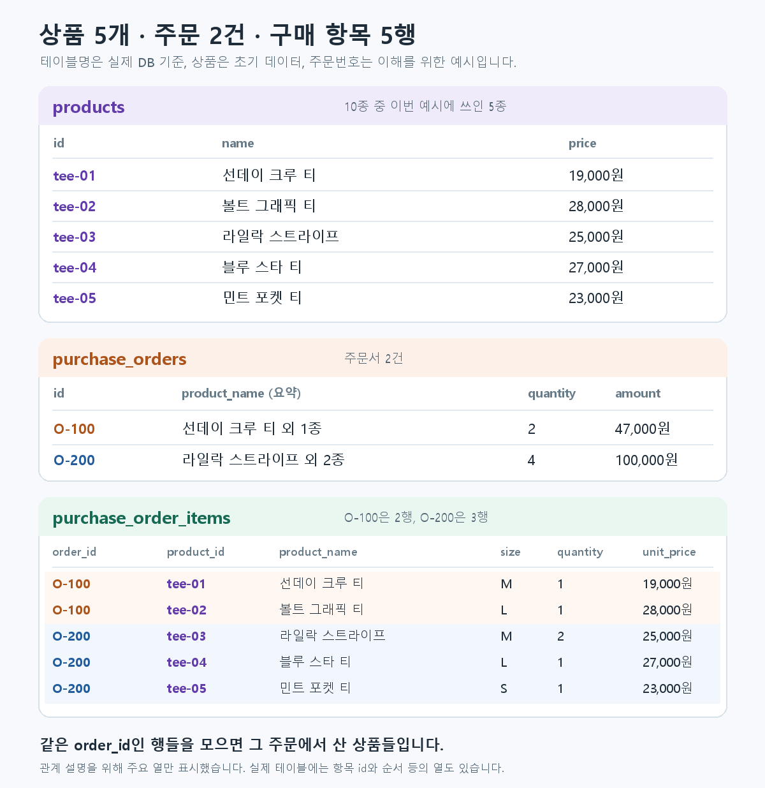

# 상품·주문·결제 도메인

현재 프로젝트는 티셔츠 스토어의 **상품 선택 → 주문 항목 기록 → 테스트 결제**를 구현한다. 회원, 배송, 재고 예약·차감, 관리자 상품 수정 기능은 아직 없다.

## 주문한 상품은 어디에 있나요?

위 예시에서 주문 `O-100`의 상품은 `purchase_order_items`의 `order_id = O-100`인 두 행이다. `O-200`에는 세 행이 있다. 각 행의 `product_id`는 `products.id`를 가리킨다.

Java에서도 `OrderItem.order`가 `order_id`를 관리한다. `PurchaseOrder`에 항목 목록을 별도로 두지 않고, 주문을 조회할 때 `OrderItemRepository`가 주문번호로 항목을 읽는다. 새 주문은 주문과 항목을 같은 DB 트랜잭션에서 저장한다.

## 현재 상품과 구입 당시 값

`OrderItem.product_id`는 `products.id`를 참조한다. 상품 가격·이름이 바뀌어도 과거 주문의 `OrderItem.unit_price`와 `product_name`은 그대로다. 상품을 판매 중지하려면 `products.active = false`로 표시한다. 과거 주문이 참조하는 상품 행을 삭제하는 것은 DB 외래 키가 막는다.

`PurchaseOrder`는 항목의 수량과 단가를 합산해 주문 총수량·금액을 만든다. React가 보낸 가격은 사용하지 않는다. `payments.order_id`도 `purchase_orders.id`를 참조한다. 결제 API가 주문번호로 결제를 다루므로 `Payment`에는 주문 ID만 두고 JPA 양방향 연관관계는 만들지 않았다.

## 운영 범위

이 구조는 **결제 학습용 쇼핑몰의 상품·주문·결제 기반**이다. 실제 판매를 시작하려면 사이즈별 SKU와 재고 예약·차감·해제, 주문 만료, 구매자 인증과 주문 접근 권한, 배송·반품·환불, 관리자 상품 관리, 결제 미확정 건의 운영 대조가 추가로 필요하다. 재고 수치만 넣고 결제 확정 전후 처리 없이 판매 가능하다고 표시하지 않는다.
