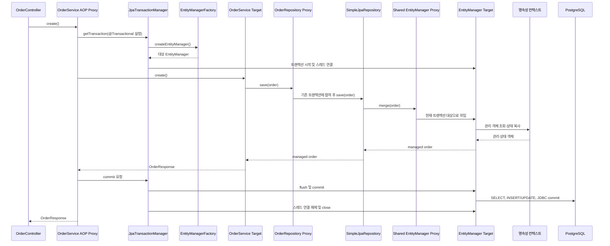

# Spring MVC 요청이 JPA를 거쳐 DB까지 가는 객체와 프록시 흐름

이 문서는 이 프로젝트의 주문 생성 요청이 컨트롤러, 서비스, Repository, `EntityManager`, Hibernate와 JDBC를 거쳐 PostgreSQL까지 도달하는 과정을 설명한다.

핵심 질문은 다음 세 가지다.

1. 각 객체의 생성자나 필드에는 어떤 의존성 참조가 들어가며, 그것은 프록시인가 대상 객체인가?
2. 각 프록시는 왜 필요하고 어떤 대상 객체 또는 실행 전략에 위임하는가?
3. 트랜잭션과 영속성 컨텍스트는 어느 시점에 만들어지고 종료되는가?

프로젝트에서 사용하는 실제 코드는 다음 파일에서 확인할 수 있다.

- [OrderController](../src/main/java/com/example/payment/order/OrderController.java)
- [OrderService](../src/main/java/com/example/payment/order/OrderService.java)
- [OrderRepository](../src/main/java/com/example/payment/order/OrderRepository.java)
- [PurchaseOrder](../src/main/java/com/example/payment/order/PurchaseOrder.java)

## 1. 먼저 구분해야 하는 세 가지

빈, 싱글톤, 프록시는 같은 개념이 아니다.

```text
Bean
→ Spring 컨테이너가 생성하고 관리하는 객체인가?

Singleton
→ 컨테이너 안에 그 빈을 기본적으로 한 개만 두는가?

Proxy
→ 대상 객체를 호출하기 전에 중간 객체가 호출을 가로채는가?
```

프록시도 JVM 메모리에 존재하는 실제 Java 객체다. 따라서 이 문서에서는 프록시와 구분되는 안쪽 객체를 가리킬 때 `실제 객체`보다 `대상 객체(target)`라는 표현을 사용한다.

프록시가 적용되면 외부에 노출되는 프록시와 내부의 대상 객체는 서로 다른 Java 객체다.

`OrderService`는 기본적으로 singleton scope의 빈이다. Spring은 실제 `OrderService` 대상 객체를 생성하고 의존성을 주입하며 초기화한다. 트랜잭션 AOP가 적용되면 해당 빈의 외부 노출 객체는 대상 객체를 감싼 싱글톤 프록시가 된다.

대상 객체가 별도의 이름을 가진 두 번째 빈으로 등록되는 것은 아니다. 일반적인 자동 프록시 생성에서는 프록시가 사용하는 `SingletonTargetSource`가 동일한 대상 객체를 보관하고 호출을 위임한다.

```text
BeanDefinition
└─ orderService (singleton scope)

Spring Singleton Registry
└─ "orderService" ───────────────┐
                                  ▼
                     트랜잭션 프록시 객체
                                  │
                                  │ SingletonTargetSource
                                  ▼
                     실제 OrderService 대상 객체
```

따라서 `orderService`를 기준으로 세면 BeanDefinition, 빈 이름, Singleton Registry 등록 항목은 각각 하나다. 하지만 JVM에 존재하는 Java 인스턴스를 기준으로 세면 프록시 객체 하나와 대상 객체 하나, 총 두 개다. 대상 객체도 Spring이 생성하고 초기화·소멸 생명주기를 관리하지만, 별도의 빈 이름으로 조회할 수 있는 독립적인 두 번째 빈은 아니다.

```text
컨테이너에 두 개의 독립적인 빈이 등록됨
├─ orderServiceProxy
└─ orderServiceTarget
→ 아님

컨테이너에 하나의 빈이 프록시로 등록·노출됨
└─ orderService → 프록시 → 대상 객체
→ 맞음
```

`applicationContext.getBean("orderService")`로 조회하거나 다른 빈에 `OrderService`를 주입하면 대상 객체가 아니라 프록시가 전달된다.

`@Service`, `@Component`, `@Controller`는 우선 클래스를 Spring Bean으로 등록한다. 이 어노테이션 자체가 프록시를 만드는 것은 아니다. 트랜잭션, 캐시, 비동기, 보안 등의 부가 기능이 필요할 때 프록시가 추가된다.

## 2. 의존성 참조와 런타임 호출 흐름

먼저 다음 두 가지를 구분해야 한다.

```text
의존성 참조 관계
→ 어떤 객체의 필드에 어떤 참조가 들어 있는가?

런타임 호출 관계
→ 요청이 들어왔을 때 어떤 객체와 자원을 거쳐 DB까지 가는가?
```

### 2.1 객체가 보관하는 의존성 참조

애플리케이션이 시작되어 싱글톤 빈들이 준비된 뒤의 참조 관계는 다음과 같다.

```text
OrderController 객체
  └─ orderService 필드
       → OrderService AOP 프록시
            └─ target
                 → OrderService 대상 객체
                      └─ orderRepository 필드
                           → OrderRepository 프록시
                                └─ 기본 CRUD 호출의 대상
                                     → SimpleJpaRepository
                                          └─ entityManager 필드
                                               → 공유 EntityManager 프록시
                                                    └─ 호출 시점에 대상을 찾음
                                                         → 현재 트랜잭션의 대상 EntityManager
```

여기서 대상 `EntityManager`는 싱글톤 서비스나 Repository 필드에 고정되어 있지 않다. 트랜잭션이 시작될 때 준비되어 현재 실행 문맥에 연결되고, 공유 `EntityManager` 프록시가 호출 시점에 찾아 사용한다.

### 2.2 요청이 들어왔을 때의 호출 흐름

주문 생성 요청 `POST /orders`의 큰 흐름은 다음과 같다.

```text
HTTP 요청
  ↓
DispatcherServlet과 Spring MVC
  ↓
OrderController 싱글톤 객체
  ↓
OrderService AOP 프록시
  ├─ 호출 전: TransactionInterceptor
  │    └─ JpaTransactionManager
  │         ├─ EntityManagerFactory로 대상 EntityManager 준비
  │         └─ 트랜잭션 시작 및 스레드 연결
  ├─ proceed: OrderService 대상 객체
  └─ 호출 후: JpaTransactionManager에 commit 또는 rollback 요청
  ↓
OrderRepository 프록시
  ↓
SimpleJpaRepository 또는 쿼리 실행기
  ↓
공유 EntityManager 프록시
  ↓
현재 트랜잭션의 대상 EntityManager
  ↓
영속성 컨텍스트
  ↓
Hibernate SQL 실행 계층
  ↓
JDBC Connection과 PostgreSQL 드라이버
  ↓
PostgreSQL
```

각 프록시는 목적이 다르다.

```text
Service AOP 프록시
→ 대상 메서드 호출 앞뒤에 트랜잭션 처리를 추가한다.

Repository 프록시
→ 호출된 Repository 메서드에 맞는 구현이나 쿼리 실행 방법을 선택한다.

공유 EntityManager 프록시
→ 현재 스레드와 트랜잭션에 맞는 대상 EntityManager를 선택한다.

Hibernate 지연 로딩 프록시
→ 아직 조회하지 않은 엔티티 데이터를 실제 접근 시점에 조회한다.
```

Hibernate 지연 로딩 프록시는 모든 조회에서 반드시 나타나는 단계가 아니다. 지연 로딩 연관관계나 `getReference()` 등을 사용할 때 나타난다. 현재 `PurchaseOrder`에는 지연 로딩 연관관계가 없으므로 주문 저장 흐름의 필수 단계가 아니다.

## 3. 객체별 역할과 수명

| 객체 또는 계층 | 호출되거나 사용되는 객체 | 위임 대상 또는 내부 상태 | 역할 | 일반적인 수명 |
| --- | --- | --- | --- | --- |
| Controller | `OrderController` 객체 | 자신의 요청 처리 메서드 | HTTP 요청을 서비스 호출로 변환 | 애플리케이션 동안 싱글톤 |
| Service AOP | `OrderService` 프록시 | `OrderService` 대상 객체 | 트랜잭션 등 메서드 앞뒤의 부가 기능 | 프록시는 싱글톤 빈으로 노출되고 동일한 대상 인스턴스를 계속 사용 |
| 트랜잭션 처리 | 프록시 내부의 `TransactionInterceptor` | `JpaTransactionManager` | 트랜잭션 속성을 읽고 시작·참여·완료를 요청 | 보통 싱글톤 인프라 |
| 트랜잭션 관리자 | `JpaTransactionManager` | `EntityManagerFactory`, 현재 트랜잭션 자원 | 대상 `EntityManager` 준비, 바인딩, commit·rollback | 보통 싱글톤 |
| Repository | `OrderRepository` 프록시 | `SimpleJpaRepository`, 쿼리 실행기, 사용자 구현 | 인터페이스 구현 및 메서드별 실행 전략 선택 | 보통 싱글톤 |
| JPA 팩토리 | `EntityManagerFactory` | Hibernate 팩토리 구현 | 대상 `EntityManager` 생성 | 애플리케이션 동안 싱글톤, 스레드 안전 |
| JPA 접근 창구 | 공유 `EntityManager` 프록시 | 현재 트랜잭션의 대상 `EntityManager` | 현재 실행 문맥의 대상 선택 | 프록시는 장기간 재사용 |
| JPA 작업 단위 | 대상 `EntityManager` | Hibernate에서는 `Session` 구현 | 영속성 컨텍스트를 조작하고 SQL 실행을 준비 | 보통 트랜잭션 또는 요청 범위 |
| 상태 관리 | 영속성 컨텍스트 | 관리 엔티티, 식별 정보, 스냅샷 | 동일성 보장, 변경 감지, 쓰기 지연 | 대상 `EntityManager`와 연결 |
| ORM | Hibernate | SQL 생성·flush·JDBC 호출 코드 | 객체 상태를 관계형 DB 작업으로 변환 | 애플리케이션 설정과 작업 단위에 따라 다름 |
| DB 연결 | JDBC `Connection` | 커넥션 풀에서 빌린 실제 연결 | SQL을 DB에 전달하고 DB 트랜잭션 수행 | 트랜잭션 동안 대여 후 반환 |

## 4. Controller: 보통 일반 싱글톤 객체

프로젝트의 컨트롤러는 다음과 같다.

```java
@RestController
public class OrderController {
    private final OrderService orderService;

    public OrderController(OrderService orderService) {
        this.orderService = orderService;
    }

    @PostMapping("/orders")
    public ResponseEntity<OrderResponse> create() {
        OrderResponse order = orderService.create();
        // 응답 생성
    }
}
```

`@RestController`는 이 객체를 Spring MVC의 요청 처리 대상으로 등록한다. 트랜잭션이나 별도의 AOP 기능이 없다면 `OrderController` 자체는 일반 싱글톤 객체다.

컨트롤러가 하는 일은 다음과 같다.

```text
HTTP 요청을 Java 메서드 호출로 받기
→ 입력값 변환과 검증
→ 서비스 호출
→ 서비스 결과를 HTTP 응답으로 변환
```

컨트롤러의 `orderService` 필드에는 `OrderService` 대상 객체가 아니라 Spring이 외부에 노출한 `OrderService` 프록시가 주입된다.

## 5. Service AOP 프록시: 같은 대상을 호출하면서 앞뒤를 감싼다

프로젝트의 `OrderService.create()`에는 `@Transactional`이 있다.

```java
@Service
public class OrderService {

    @Transactional
    public OrderResponse create() {
        PurchaseOrder order = new PurchaseOrder("티셔츠", 1, 10_000);
        order = orderRepository.save(order);
        return OrderResponse.of(order, null);
    }
}
```

이 프로젝트에서는 트랜잭션 기능이 활성화되어 있다. Spring은 적용 가능한 `@Transactional` 메서드를 발견하면 `OrderService` 호출을 가로챌 AOP 프록시를 만든다.

```text
OrderController.orderService
  ↓ 참조하는 객체
OrderService AOP 프록시
  ↓ 항상 위임하는 대상
OrderService 대상 객체
```

프록시 안의 `TransactionInterceptor`가 하는 일은 개념적으로 다음과 같다.

```java
TransactionStatus status = transactionManager.getTransaction(settings);

try {
    Object result = targetOrderService.create();
    transactionManager.commit(status);
    return result;
} catch (Throwable exception) {
    if (rollbackRules.requireRollback(exception)) {
        transactionManager.rollback(status);
    } else {
        transactionManager.commit(status);
    }
    throw exception;
}
```

기본 롤백 규칙에서는 `RuntimeException`과 `Error`가 롤백 대상이다. 체크 예외까지 롤백하려면 `rollbackFor` 같은 설정이 필요하다. 또한 기존 트랜잭션에 참여한 상태라면 위의 `commit()` 호출이 새로운 물리적 커밋을 발생시키는 것은 아니며, 최종 커밋은 바깥쪽 트랜잭션 경계가 담당한다.

기본 전파 속성은 `REQUIRED`다.

```text
기존 트랜잭션 없음
→ 새 트랜잭션 시작

기존 트랜잭션 있음
→ 기존 트랜잭션 참여
```

서비스 프록시는 보통 여러 서비스 대상 객체 중 하나를 고르는 라우터가 아니다. 동일한 대상 객체를 호출하되, 적용할 인터셉터 파이프라인을 고른다.

```text
proxy.create()
→ TransactionInterceptor
→ 대상 객체의 create()

proxy.somePlainMethod()
→ 트랜잭션 인터셉터 적용 없음
→ 대상 객체의 somePlainMethod()
```

서비스 클래스에 대상이 되는 `@Transactional` 메서드가 하나만 있어도 빈 전체가 프록시로 노출될 수 있다. 하지만 트랜잭션 처리는 설정이 적용된 메서드에만 수행된다.

## 6. Service 대상 객체: 비즈니스 작업의 순서를 정한다

`OrderService` 대상 객체는 프록시 안쪽에서 비즈니스 흐름을 실행한다.

```text
주문 객체 생성
→ 주문 저장
→ 응답 객체 생성
```

서비스 대상 객체 자체가 트랜잭션을 시작하는 것은 아니다. 외부의 AOP 프록시와 트랜잭션 인프라가 트랜잭션을 준비한 뒤 대상 메서드를 호출한다.

같은 객체 내부에서 `this.inner()`를 호출하면 대상 객체가 자신의 메서드를 직접 호출한다.

```text
외부 → Service 프록시 → 대상 객체의 outer()
                         └─ this.inner()
                            대상 객체의 inner() 직접 호출
```

따라서 `inner()`에 별도의 `@Transactional` 전파 설정이 있더라도 자기 호출에서는 적용되지 않는다. 다만 `outer()`에서 이미 트랜잭션이 시작되었다면 `inner()`의 코드는 그 기존 트랜잭션 안에서 실행된다.

## 7. Repository 프록시: 메서드에 맞는 실행 방법을 선택한다

프로젝트의 Repository는 구현 클래스가 없는 인터페이스다.

```java
public interface OrderRepository
        extends JpaRepository<PurchaseOrder, String> {
}
```

인터페이스는 직접 생성할 수 없다.

```java
new OrderRepository(); // 불가능
```

Spring Data JPA는 애플리케이션 초기화 과정에서 `OrderRepository`를 구현하는 프록시 객체를 만든다. 이 프록시 자체가 Spring Bean으로 서비스 대상 객체에 주입된다.

```text
OrderService 대상 객체의 orderRepository
  ↓ 참조하는 객체
OrderRepository 프록시
```

Repository 프록시는 호출된 메서드를 기준으로 실행 전략을 선택한다.

```text
save(entity)
→ SimpleJpaRepository.save()

findById(id)
→ SimpleJpaRepository.findById()

findByEmail(email)
→ 메서드 이름으로 준비된 쿼리 실행

@Query 메서드
→ 지정된 JPQL 또는 native query 실행

사용자 정의 메서드
→ Repository fragment 구현으로 위임
```

Repository 프록시에는 트랜잭션과 JPA 예외 변환 인터셉터도 포함될 수 있다. 서비스에서 이미 트랜잭션이 시작됐다면 Repository의 기본 `REQUIRED` 트랜잭션은 새 트랜잭션을 만들지 않고 기존 트랜잭션에 참여한다.

```text
OrderService.create() 트랜잭션 시작
  ↓
OrderRepository.save()
  ↓ 기존 트랜잭션 참여
SimpleJpaRepository.save()
```

Repository 생성과 `save()` 내부의 더 자세한 구현은 [OrderRepository.save()가 DB까지 도달하는 전체 코드 경로](spring-data-jpa-save-flow.md)에서 확인할 수 있다.

## 8. SimpleJpaRepository: 기본 CRUD의 대상 구현

`JpaRepository`가 제공하는 기본 CRUD의 대표 구현체가 `SimpleJpaRepository`다.

`save()`는 개념적으로 다음과 같다.

```java
if (entityInformation.isNew(entity)) {
    entityManager.persist(entity);
    return entity;
}

return entityManager.merge(entity);
```

현재 프로젝트의 `PurchaseOrder`는 생성자에서 문자열 UUID를 미리 ID에 넣고 `@Version` 필드가 없다. 따라서 새 Java 객체라도 Spring Data의 기본 새 엔티티 판정에서는 `merge()` 경로를 선택한다.

```text
PurchaseOrder.id != null
→ isNew(order) == false
→ entityManager.merge(order)
```

이때 `SimpleJpaRepository`가 들고 있는 `entityManager`도 대상 `EntityManager`를 고정해서 보관하지 않고 공유 프록시를 참조한다.

## 9. TransactionInterceptor, JpaTransactionManager와 EntityManagerFactory

서비스 AOP 프록시가 혼자 트랜잭션의 모든 작업을 처리하는 것은 아니다. 각 인프라 객체의 역할은 다음과 같이 나뉜다.

```text
OrderService AOP 프록시
→ 호출을 가로채고 인터셉터 체인을 실행

TransactionInterceptor
→ @Transactional 설정을 읽고 트랜잭션 실행 절차를 적용

JpaTransactionManager
→ 기존 트랜잭션 참여 여부 판단
→ 새 트랜잭션이면 대상 EntityManager 준비
→ 스레드에 자원 연결
→ commit 또는 rollback

EntityManagerFactory
→ 대상 EntityManager를 생성하는 스레드 안전한 팩토리
```

새 트랜잭션이 필요한 경우의 핵심 관계는 다음과 같다.

```text
TransactionInterceptor
  ↓ getTransaction()
JpaTransactionManager
  ↓ createEntityManager()
EntityManagerFactory
  ↓
대상 EntityManager 생성
  ↓
트랜잭션 시작 및 현재 스레드에 연결
```

`EntityManagerFactory`는 애플리케이션에서 보통 하나를 장기간 공유해도 되는 스레드 안전한 객체다. 반면 이 팩토리가 만드는 대상 `EntityManager`는 스레드 안전하지 않으며 작업 단위별로 분리해야 한다.

기존 트랜잭션이 있다면 기본 `REQUIRED`는 대상 `EntityManager`를 새로 만들지 않고 기존 트랜잭션의 자원에 참여한다.

## 10. 공유 EntityManager 프록시: 현재 대상 EntityManager를 찾는다

공유 `EntityManager` 프록시의 핵심 역할은 실행 문맥에 따른 대상 선택이다.

```text
같은 공유 EntityManager 프록시
  ├─ Thread A / Transaction A → 대상 EntityManager A
  └─ Thread B / Transaction B → 대상 EntityManager B
```

`@PersistenceContext`는 대상 `EntityManager`를 고정해서 주입하라는 뜻이 아니다.

```java
@PersistenceContext
private EntityManager entityManager;
```

의미는 다음과 같다.

```text
현재 영속성 컨텍스트에 접근할 수 있는
컨테이너 관리 EntityManager 참조를 주입해라.
```

현재 프로젝트의 `OrderService`가 `@PersistenceContext`를 직접 사용하지는 않는다. Spring Data JPA가 `SimpleJpaRepository`를 만들면서 같은 역할의 공유 `EntityManager` 프록시를 내부에 넣는다.

아무 주입 표시도 없는 필드에 대상 `EntityManager`가 자동으로 들어가는 것은 아니다.

```java
private EntityManager entityManager; // 자동 주입되지 않음
```

`EntityManagerFactory.createEntityManager()`로 대상 `EntityManager`를 직접 만들 수도 있지만, 그 경우 생성·트랜잭션·종료와 스레드 간 공유 방지를 개발자가 관리해야 한다. 일반적인 Spring 애플리케이션에서는 컨테이너 관리 공유 프록시를 사용한다.

트랜잭션이 시작되면 `JpaTransactionManager`가 대상 `EntityManager`를 준비하고 현재 스레드에 연결한다. 공유 프록시는 메서드가 호출될 때 그 객체를 찾아 위임한다.

```text
entityManagerProxy.merge(order)
  ↓ 현재 스레드의 트랜잭션 자원 조회
대상 EntityManager.merge(order)
```

공유 프록시는 요청을 직렬화하거나 잠그지 않는다. 여러 요청은 동시에 같은 프록시를 호출할 수 있지만 각 트랜잭션의 대상 `EntityManager`는 분리된다.

## 11. 대상 EntityManager와 영속성 컨텍스트

대상 `EntityManager`는 영속성 컨텍스트를 조작하는 JPA API이자 관리자다.

```text
대상 EntityManager
  ↓ 관리
영속성 컨텍스트
  ├─ 현재 관리 중인 엔티티
  ├─ 엔티티 ID와 Java 객체의 대응
  ├─ 변경 감지용 상태
  └─ flush 시 반영할 변경 사항
```

주요 메서드와 영속성 컨텍스트의 관계는 다음과 같다.

```text
find()
→ 영속성 컨텍스트에서 먼저 찾고, 없으면 DB 조회 후 관리

persist()
→ 새 엔티티를 관리 상태로 등록

merge()
→ 전달받은 상태를 관리 상태 객체에 복사하고 그 객체를 반환

remove()
→ 관리 엔티티를 삭제 대상으로 표시

flush()
→ 영속성 컨텍스트의 변경 사항을 SQL로 DB에 반영

clear() / close()
→ 관리하던 엔티티를 분리 상태로 전환
```

Hibernate를 JPA 구현체로 사용하면 대상 `EntityManager` 구현은 Hibernate `Session` 계열 객체다.

```text
JPA EntityManager 인터페이스
  ↓ Hibernate 구현
Hibernate Session
  ↓ 내부 상태
영속성 컨텍스트
```

## 12. 트랜잭션 시작부터 종료까지

트랜잭션이 없는 상태에서 `OrderService.create()`를 외부 호출한다고 가정한다. 기존 트랜잭션이 있으면 새 대상 `EntityManager`를 만드는 단계 없이 기존 자원에 참여한다.

```text
1. OrderService 프록시가 create() 호출을 받는다.

2. TransactionInterceptor가 @Transactional 설정을 읽고
   JpaTransactionManager에 트랜잭션을 요청한다.

3. JpaTransactionManager가 현재 스레드에 기존 트랜잭션 자원이 있는지 확인한다.

4. 기존 트랜잭션이 없으므로 EntityManagerFactory로 대상 EntityManager를 만든다.

5. JPA·DB 트랜잭션을 시작하고 대상 EntityManager를 현재 스레드에 연결한다.

6. OrderService 대상 객체의 create()를 호출한다.

7. Repository 프록시의 트랜잭션 처리는 기존 트랜잭션에 참여하고,
   SimpleJpaRepository.save()로 위임한다.

8. SimpleJpaRepository가 공유 EntityManager 프록시를 호출한다.

9. 공유 EntityManager 프록시가 현재 스레드에 연결된 대상 EntityManager를 찾는다.

10. 대상 EntityManager가 영속성 컨텍스트를 조작한다.

11. 서비스 대상 메서드가 정상 반환한다.

12. TransactionInterceptor가 JpaTransactionManager에 commit을 요청한다.

13. Hibernate가 commit 전에 flush하여 필요한 SQL을 실행한다.

14. JDBC Connection의 DB 트랜잭션을 commit한다.

15. 스레드에서 자원을 해제하고 대상 EntityManager를 닫는다.
```

마지막 정리 단계는 일반적인 트랜잭션 범위를 기준으로 설명한 것이다. OSIV가 요청 범위의 `EntityManager`를 먼저 연결한 경우에는 트랜잭션 종료가 아니라 요청 종료 시점에 닫힐 수 있다.

하나의 그림으로 합치면 다음과 같다.



이 그림에서는 읽기 쉽도록 `TransactionInterceptor`를 서비스 AOP 프록시 안에 포함해 표현했다. `JpaTransactionManager`와 대상 `EntityManager` 사이에서도 Hibernate의 트랜잭션 구현과 JDBC 계층이 세부 작업을 나누어 수행한다.

## 13. 요청이 겹쳐도 안전한 이유

컨트롤러, 서비스 프록시, 서비스 프록시가 참조하는 하나의 대상 객체, Repository 프록시와 공유 `EntityManager` 프록시는 여러 요청이 함께 사용할 수 있다.

```text
공유되는 객체
→ Controller
→ Service 프록시와 프록시가 참조하는 동일한 Service 대상 객체
→ Repository 프록시
→ 공유 EntityManager 프록시
```

반면 상태를 가진 작업 단위의 대상 객체는 분리된다.

```text
요청 A / Thread A / Transaction A
→ 대상 EntityManager A
→ 영속성 컨텍스트 A
→ JDBC Connection A

요청 B / Thread B / Transaction B
→ 대상 EntityManager B
→ 영속성 컨텍스트 B
→ JDBC Connection B
```

프록시는 현재 실행 문맥에 맞는 대상 자원을 선택한다. 대상 `EntityManager`는 스레드 안전하지 않으므로 여러 스레드에서 직접 공유하면 안 된다.

서비스 싱글톤의 개발자 정의 가변 필드도 여러 요청이 공유하므로 별도로 주의해야 한다.

```java
@Service
public class BadService {
    private String currentUser; // 요청들이 공유하므로 위험
}
```

## 14. 트랜잭션이 없을 때 EntityManager 프록시

`@Transactional`이 없는 메서드에서도 주입된 `EntityManager`는 계속 공유 프록시다. 프록시가 대상 객체로 교체되는 것이 아니다.

```text
@Transactional 있음
→ 트랜잭션 AOP와 JpaTransactionManager가 대상 EntityManager와 트랜잭션을 준비
→ 공유 프록시가 그 대상 EntityManager로 위임

@Transactional 없음
→ 공유 프록시는 그대로 존재
→ 현재 연결된 대상 EntityManager가 있는지 확인
```

바깥쪽 호출이 이미 트랜잭션을 시작했다면 어노테이션이 없는 안쪽 메서드도 같은 스레드에서 그 트랜잭션을 사용한다.

트랜잭션과 요청에 연결된 대상 `EntityManager`가 모두 없다면 조회 작업에서 임시 `EntityManager`를 사용할 수 있다. `persist()`, `remove()`, `flush()` 등 트랜잭션이 필요한 작업은 `TransactionRequiredException`이 발생할 수 있다.

## 15. 프록시를 구분하는 기준

세 프록시의 차이를 가장 짧게 정리하면 다음과 같다.

```text
Service AOP 프록시
→ 이 메서드를 호출하기 전후에 무엇을 할까?

Repository 프록시
→ 이 Repository 메서드를 어떤 구현으로 실행할까?

공유 EntityManager 프록시
→ 지금 어느 대상 EntityManager에게 보낼까?
```

조금 더 일반화하면 프록시의 용도는 다음과 같다.

```text
호출 앞뒤 부가 기능
→ 트랜잭션, 보안, 캐시, 비동기, 검증

메서드별 실행 전략 선택
→ Spring Data Repository, MyBatis Mapper, HTTP Client

현재 문맥의 대상 선택
→ EntityManager, 요청 스코프 빈

지연 실행
→ Hibernate lazy proxy, @Lazy 의존성
```

## 16. 흔한 오해 정리

### Service 프록시와 대상 객체가 각각 별도의 빈으로 등록된다

아니다. 일반적인 자동 프록시 생성에서는 `orderService`라는 BeanDefinition과 빈 이름, Singleton Registry 등록 항목이 각각 하나이며, 외부에는 프록시가 빈으로 노출된다. 프록시가 호출을 위임하기 위한 대상 객체까지 포함하면 실제 Java 객체는 두 개지만, 대상 객체가 별도의 이름을 가진 두 번째 빈으로 등록되는 것은 아니다.

### `@Service`이면 항상 프록시다

아니다. `@Service`는 빈 등록용 어노테이션이다. 트랜잭션 등 AOP 기능이 적용될 때 프록시가 만들어진다.

### `@Transactional`은 항상 새 트랜잭션을 만든다

아니다. 기본 `REQUIRED`는 기존 트랜잭션이 있으면 참여하고, 없을 때만 새로 만든다.

### `this.inner()`도 `inner()`의 `@Transactional`이 적용된다

일반적인 Spring 프록시 방식에서는 아니다. 대상 객체 내부 호출이므로 프록시를 우회한다.

### `@PersistenceContext`가 대상 EntityManager에 기능을 추가한다

아니다. 현재 영속성 컨텍스트에 접근할 수 있는 컨테이너 관리 `EntityManager` 참조를 주입하라는 JPA 표준 어노테이션이다.

### 영속성 컨텍스트는 EntityManager 프록시 안에 있다

아니다. 공유 프록시는 현재 대상을 찾는 역할이고, 영속성 컨텍스트는 대상 `EntityManager`와 연결된다.

### Repository 프록시는 트랜잭션만 처리한다

아니다. 인터페이스를 실행 가능한 객체로 구현하고 CRUD, 파생 쿼리, `@Query`, 사용자 구현을 적절한 실행기로 연결하는 것이 핵심 역할이다.

## 17. 코드에서 직접 확인하는 방법

빈의 런타임 클래스를 출력하면 프록시 여부를 확인할 수 있다.

```java
System.out.println(orderService.getClass().getName());
System.out.println(orderRepository.getClass().getName());
System.out.println(entityManager.getClass().getName());
```

환경과 프록시 방식에 따라 다음과 비슷한 이름을 볼 수 있다.

```text
OrderService$$SpringCGLIB$$...
jdk.proxy...$Proxy...
```

Spring AOP 프록시는 다음 유틸리티로도 확인할 수 있다.

```java
AopUtils.isAopProxy(orderService);
AopUtils.isJdkDynamicProxy(orderService);
AopUtils.isCglibProxy(orderService);
```

프록시 객체의 클래스 이름은 구현 세부사항이므로 비즈니스 로직에서 분기 조건으로 사용하지 않는다. 학습과 디버깅 목적으로만 확인한다.

## 18. 추천 학습 순서

1. 이 문서의 전체 흐름과 객체별 역할을 익힌다.
2. `OrderService.create()`에 중단점을 걸어 트랜잭션 안에서 호출되는지 확인한다.
3. `OrderRepository`의 런타임 클래스가 프록시인지 확인한다.
4. [JPA 참고 메모](java-jpa-notes.md)에서 `EntityManager` 기본 동작을 확인한다.
5. [OrderRepository.save()가 DB까지 도달하는 전체 코드 경로](spring-data-jpa-save-flow.md)에서 프레임워크 내부 구현을 따라간다.

마지막으로 전체 흐름을 한 문장으로 정리하면 다음과 같다.

> 컨트롤러가 서비스 프록시를 호출하면 트랜잭션 인프라가 트랜잭션을 준비하고 서비스 대상 객체를 실행한다. 서비스 대상 객체가 Repository 프록시를 호출하면 Repository 프록시가 CRUD 구현이나 쿼리 실행기를 선택한다. 그 구현이 공유 `EntityManager` 프록시를 호출하면 현재 트랜잭션의 대상 `EntityManager`로 연결되고, 대상 `EntityManager`가 영속성 컨텍스트와 Hibernate·JDBC를 통해 DB 작업을 수행한다.
