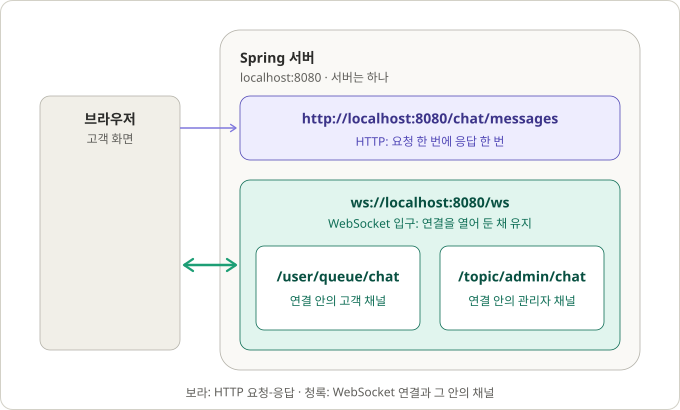
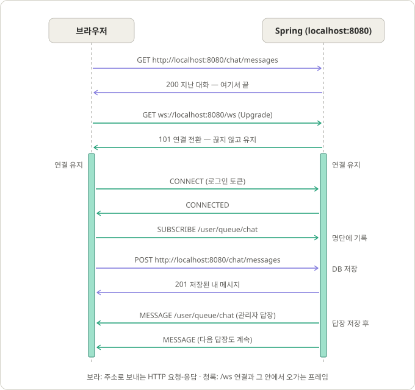

# WebSocket 주소와 STOMP 프레임

상담 알림이 어떤 주소로 연결되고, 연결 안에서 무엇이 오가는지 그림으로 설명합니다. Spring이 설정 클래스를 읽어 브로커를 만드는 순서는 [Spring이 WebSocket 설정을 읽는 방식](websocket-configuration.md), 상담 규칙과 구독 권한은 [1:1 상담](chat.md#실시간-전달)에 있습니다.

그림의 주소는 Spring 서버에 직접 연결한 경우입니다. 개발 중에는 브라우저가 Vite 개발 서버(`127.0.0.1:5173`)로 요청하고, [vite.config.ts](../frontend/vite.config.ts)의 프록시가 API 요청과 `/ws` 연결을 `127.0.0.1:8080`으로 넘깁니다.

## 주소 구조



- 서버는 `localhost:8080` 하나입니다. HTTP API와 WebSocket이 같은 서버, 같은 포트를 씁니다.
- `/chat/messages` 같은 HTTP 경로는 요청 한 번에 응답 한 번으로 끝납니다.
- `/ws`는 WebSocket 연결을 여는 입구입니다. 연결 주소는 이것 하나뿐입니다.
- `/user/queue/chat`, `/topic/admin/chat`은 `/ws` 연결 안에서만 쓰는 채널 이름입니다. 주소가 아니므로 앞에 `localhost:8080`이 붙지 않습니다([채널은 요청도 연결도 아니다](#채널은-요청도-연결도-아니다)).

전체 주소를 나누면 다음과 같습니다.

```text
ws://  localhost  :8080  /ws
 │        │         │      └─ 경로: 서버 코드에 적는 부분 (ChatWebSocketConfiguration.ENDPOINT)
 │        │         └──────── 포트: Spring 서버
 │        └────────────────── 호스트: 내 컴퓨터
 └─────────────────────────── 방식: WebSocket (암호화하면 wss)
```

서버 코드에는 경로 `/ws`만 적습니다. 호스트와 포트는 브라우저가 실행 중에 지금 보고 있는 화면 주소에서 가져와 붙입니다([chatSocket.ts](../frontend/src/chat/chatSocket.ts)의 `socketUrl()`).

## 요청과 응답 순서



| 순서 | 일어나는 일 | 방식 |
| --- | --- | --- |
| 1 | 지난 대화를 `GET /chat/messages`로 불러온다. 응답을 받으면 끝난다 | HTTP |
| 2 | `GET /ws`에 `Upgrade: websocket` 헤더를 붙여 보낸다. 서버가 `101`로 답하면 연결이 끊기지 않고 유지된다. 이 과정을 핸드셰이크라 한다 | HTTP → WebSocket |
| 3 | 열린 연결 안에서 `CONNECT`(로그인 토큰)를 보내고 `CONNECTED`를 받는다 | STOMP 프레임 |
| 4 | `SUBSCRIBE /user/queue/chat`을 보낸다. 서버는 응답 없이 구독 명단에 적는다 | STOMP 프레임 |
| 5 | 메시지를 보낼 때는 `POST /chat/messages`로 따로 요청한다. `/ws` 연결을 거치지 않는다 | HTTP |
| 6 | 관리자 답장이 저장되면 서버가 먼저 `MESSAGE`를 보낸다. 브라우저는 묻지 않았는데도 받는다 | STOMP 프레임 |

HTTP는 항상 브라우저가 먼저 물어야 서버가 답합니다. WebSocket은 연결을 열어 두기 때문에 서버가 먼저 보낼 수 있습니다. 언제 올지 모르는 답장 알림에 WebSocket을 쓰는 이유입니다.

그림에는 생략했지만, 고객이 보낸 메시지도 저장된 뒤 `/user/queue/chat`으로 알림이 한 번 더 옵니다. 같은 메시지가 `201` 응답과 알림으로 두 번 오지만, 화면은 메시지 번호로 합쳐 한 번만 보여 줍니다([끊김과 다시 연결](chat.md#끊김과-다시-연결)).

## 통로, 약속, 프레임

`/ws` 연결이 열리면 그 안에서 통신이 이어집니다. 평소 쓰는 HTTP API와 나란히 놓으면 WebSocket, STOMP, 프레임이 각각 어느 자리에 있는지 보입니다.

| 층 | HTTP API | 채팅 알림 | 하는 일 |
| --- | --- | --- | --- |
| 통로 | TCP 연결 | **WebSocket** (`/ws` 연결) | 내용물을 실어 나른다. 내용물의 뜻은 모른다 |
| 약속 (프로토콜) | HTTP | **STOMP** | 메시지를 어떻게 적을지 정한다: 종류, 보낼 곳, 헤더, 본문 |
| 메시지 하나 | HTTP 요청, HTTP 응답 | **STOMP 프레임** | 약속대로 쓴 메시지 하나 |

STOMP와 프레임은 별개가 아닙니다. HTTP와 HTTP 요청의 관계처럼, STOMP는 규칙이고 프레임은 그 규칙대로 쓴 메시지 하나입니다. HTTP는 메시지를 방향에 따라 요청과 응답으로 나눠 부르고, STOMP는 방향과 상관없이 모두 프레임이라 부릅니다.

통로에도 자기 운반 단위가 있습니다. HTTP 요청이 TCP 패킷에 실려 가듯, STOMP 프레임은 WebSocket 프레임에 실려 갑니다. 이름에 둘 다 "프레임"이 들어 있지만 서로 다른 층의 단위이고, 이 문서에서 말하는 프레임은 모두 STOMP 프레임입니다. WebSocket도 실제로는 TCP 위에서 돌지만, 내용물을 실어 나르기만 한다는 역할이 같아서 표에서 TCP와 같은 줄에 놓았습니다.

WebSocket 자체는 글자를 주고받는 통로만 제공하고, "이 채널을 구독한다", "이건 그 채널 메시지다" 같은 뜻은 정해 주지 않습니다. 그래서 그 위에 STOMP를 얹어 씁니다. STOMP 없이 WebSocket만 쓰면 메시지 형식, 회원별 전달, 연결 인증, 끊김 감지를 직접 만들어야 합니다([1:1 상담](chat.md#stomp)).

## 프레임 모양

서버가 고객에게 관리자 답장을 알리는 `MESSAGE` 프레임입니다.

```text
MESSAGE                                ← 명령: 이 프레임의 종류
destination:/user/queue/chat           ← 헤더: 이름:값
content-type:application/json
                                       ← 빈 줄: 헤더 끝
{"id":6,"content":"L이 3cm 더 커요"}     ← 본문
                                       ← 끝 표시 (눈에 안 보이는 NULL 문자)
```

STOMP는 HTTP를 본떠 만들어서 생김새가 HTTP 요청과 거의 같습니다.

```text
[HTTP 요청]                             [STOMP 프레임]
POST /chat/messages HTTP/1.1           SUBSCRIBE
Authorization: Bearer eyJ...           id:sub-0
Content-Type: application/json         destination:/user/queue/chat

{"content":"문의합니다"}
```

다른 점은 두 가지입니다.

- **보내는 방법**: HTTP 요청은 주소로 매번 새로 보냅니다. STOMP 프레임은 이미 열린 `/ws` 연결 안으로 흘려보냅니다.
- **응답**: HTTP 요청에는 반드시 응답 하나가 짝으로 옵니다. STOMP 프레임은 짝이 정해져 있지 않습니다.

## 이 프로젝트에서 쓰는 프레임

| 프레임 | 방향 | 뜻 |
| --- | --- | --- |
| `CONNECT` | 브라우저 → 서버 | 연결 인사와 로그인 토큰 |
| `CONNECTED` | 서버 → 브라우저 | 인사 승낙 |
| `SUBSCRIBE` | 브라우저 → 서버 | 이 채널을 받겠다 |
| `MESSAGE` | 서버 → 브라우저 | 구독한 채널에 온 메시지 |
| `SEND` | 브라우저 → 서버 | 메시지 보내기. 이 프로젝트는 HTTP로 보내므로 거부한다 |
| `ERROR` | 서버 → 브라우저 | 거부한 이유를 알리고 연결을 닫는다 |

## 채널은 요청도 연결도 아니다

`/user/queue/chat` 같은 채널은 HTTP 요청을 보내는 주소가 아니고, 따로 열리는 연결(소켓)도 아닙니다. STOMP 프레임의 `destination` 헤더에 적는 문자열일 뿐입니다. 소켓은 `/ws` 연결 하나뿐이고, 채널을 구독해도 새 연결은 생기지 않습니다.

| | HTTP 요청 (`POST /chat/messages`) | `SUBSCRIBE` 프레임 |
| --- | --- | --- |
| 보내는 곳 | URL로 새 요청을 보낸다 | 이미 열린 `/ws` 연결 안으로 보낸다 |
| 응답 | 반드시 응답 하나가 온다(`201` 등) | 응답이 없다. 서버는 명단에 적기만 한다. 거부할 때만 `ERROR`가 온다 |
| `/user/queue/chat`의 역할 | 해당 없음 | `destination` 헤더에 적는 채널 이름 |

같은 이름이 방향에 따라 다른 뜻으로 두 번 나옵니다.

```text
브라우저 → 서버                      서버 → 브라우저
SUBSCRIBE                            MESSAGE
id:sub-0                             destination:/user/queue/chat
destination:/user/queue/chat         subscription:sub-0

                                     {"content":"L이 3cm 더 커요", ...}
```

- `SUBSCRIBE`에서는 "이 채널을 받겠다"는 뜻입니다. `id`는 브라우저가 이 구독에 붙인 번호입니다.
- `MESSAGE`에서는 "이 메시지는 그 채널 것이다"라는 꼬리표입니다. `subscription`에 구독 번호가 돌아오므로 어느 구독으로 온 메시지인지 알 수 있습니다.

모든 고객이 같은 `/user/queue/chat`을 구독하지만, `/user`로 시작하는 주소는 Spring이 연결에 붙은 회원별로 나눠 전달합니다. 그래서 각 고객은 자기 메시지만 받습니다.

## 코드 위치

| 쪽 | 파일 | 하는 일 |
| --- | --- | --- |
| 브라우저 | [chatSocket.ts](../frontend/src/chat/chatSocket.ts) | `/ws` 주소를 만들고, `CONNECT`에 토큰을 담고, 연결되면 구독한다 |
| 브라우저 | [ChatWidget.tsx](../frontend/src/components/ChatWidget.tsx) | 로그인한 고객의 쇼핑몰 화면이 뜨면 연결을 연다. 문의 창을 닫아 두어도 유지한다 |
| 브라우저 | [AdminChatPage.tsx](../frontend/src/pages/AdminChatPage.tsx) | 관리자 상담 화면에서 `/topic/admin/chat`을 구독한다 |
| 서버 | [ChatWebSocketConfiguration](../src/main/java/com/example/payment/chat/infrastructure/websocket/ChatWebSocketConfiguration.java) | `/ws` 입구를 등록하고 브로커와 heartbeat를 설정한다. 채널 이름 상수도 여기 있다 |
| 서버 | [SecurityConfiguration](../src/main/java/com/example/payment/config/SecurityConfiguration.java) | `/ws` 핸드셰이크 요청을 로그인 검사 없이 통과시킨다. 브라우저가 이 요청에 토큰 헤더를 붙일 수 없기 때문이다 |
| 서버 | [ChatSocketAuthorization](../src/main/java/com/example/payment/chat/infrastructure/websocket/ChatSocketAuthorization.java) | 들어오는 프레임을 검사한다. `CONNECT`는 토큰, `SUBSCRIBE`는 구독 권한을 확인하고 `SEND`는 거부한다 |
| 서버 | [ChatNotifier](../src/main/java/com/example/payment/chat/infrastructure/websocket/ChatNotifier.java) | 메시지가 저장되면 열린 연결로 `MESSAGE`를 보낸다 |

핸드셰이크 자체는 우리 코드가 아니라 Spring의 `WebSocketHttpRequestHandler`가 처리합니다. `registry.addEndpoint("/ws")`가 이 처리기를 `/ws`에 연결합니다([Spring이 WebSocket 설정을 읽는 방식](websocket-configuration.md)).
